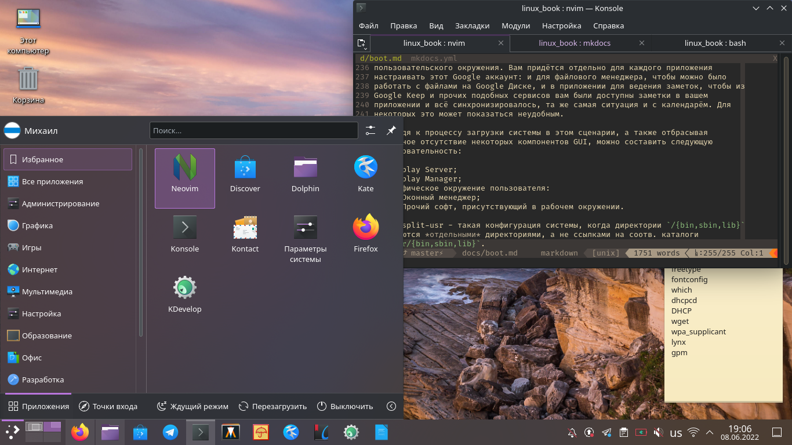

# Строение GNU/Linux 2. Процесс загрузки

## Цикл загрузки

В нормальных условиях и полной конфигурации системы, когда всё необходимое ПО
присутствует и корректно функционирует, загрузка системы делится на следующие
пять этапов:

1. Загрузчик;
2. Ядро или initramfs/initrd + ядро;
3. Система инициализации;
4. Программа, запрашивающая имя пользователя и его пароль;
5. Окружение пользователя.

## Загрузчик и ядро Linux

Задача загрузчика - инициализировать ядро операционной системы (в нашем случае -
ядро Linux). В помощь ядру загрузчик может использовать *начальный образ
загрузки* (простите за тавтологию) - `initrd` или `initramfs` (initial ram disk
или initial ram filesystem соотв.), представляющий собой архив с образом
файловой системы, разворячивающейса в ОЗУ в начале загрузки. В initrd/initramfs
находятся нужные драйверы, скрипты и прочее, что необходимо для инициализации
оборудования и выполнения прочих действий.

После начального образа загрузки стартует ядро. Оно *обычно* находится в
`/boot`, в своём названии имеет `vmlinuz`:

- `vm` - поддержка виртуальной памяти;
- `linu` - Linux;
- `z` - указатель того, что файл сжат (формат сжатия обычно zlib, однако можно
  всретить и bz2, lzma и некоторые другие).

## Система инициализации

После ядра стартует *система инициализации*, которая запускает все остальные
процессы. Имеет PID (Process ID) = 1. Примерно до 2010 года де-факто стандартом
системы инициализации в GNU/Linux был SysVInit, но после него были попытки
заменить систему инициализации на другую. Например, в Ubuntu первое время
использовался upstart, а в Gentoo использовался и используется сейчас OpenRC. В
недрах компании Red Hat была создана система инициализации systemd, которая в
данный момент используется в подавляющем числе дистрибутивов GNU/Linux, несмотря
на всю свою критику со стороны сторожилов GNU/Linux.

Кроме того, в дистрибутиве Slackware используются загрузочные скрипты в стиле
BSD. Не даром Slackware называют "самым юниксовым" среди GNU/Linux.

Кроме этих систем инициализации есть Runit, Finit и прочие. У каждой системы
свои достоинства и недостатки, но самым популярным инитом стал, всё-таки,
systemd. Это связано с тем, что некоторые детали в нём реализованы намного
удобнее, чем в других СИ, да и systemd был разработан довольно большой и
успешной компанией, поэтому его широкое распространение вполне предсказуемо.

Исполняемый двоичный файл системы инициализации находится в `/sbin/init`,
поэтому ядро ищет его именно там. Но ему вы можете указать альтернативный путь
до инита, указав опцию `init=/путь/до/инита`, чтобы загружать другую систему
инициализации или программу. Например, опция `init=/bin/bash` указывает ядру
запускать не систему инициализации, а оболочку BASH. Это может понадобиться при
восстановлении дистрибутива в случае сбоев.

## systemd

### Достоинства

- Параллельный запуск служб и прочие вещи, помогающие ускорить запуск/выключение
  ОС;
- Запуск сервисов по умолчанию (аналог `cron`);
- Смена корня (аналог `chroot`);
- Простой и лаконичный синтаксис служб;
- Удобный контроль этих служб;
- Анализ времени загрузки системы.

### Недостатки

- Не Unix Way. systemd - монолитная и сложная система, заменяющая собой не
  только систему инициализации, но и кучу других утилит. Некоторые из пунктов,
  перечисленных в "достоинствах", можно отнести и к пункту "Недостаки". Кроме
  того, есть личности, которые сетуют на плохое качество кода. Но code review
  этого инита я не проводил, поэтому качество оценить, увы, не могу.
- systemd плохо работает на split-usr (CDS в терминологии Calmira GNU/Linux)
  конфигурации, о чём честно предупреждает во время сборки из исходного кода.
  Кроме того, поддержку split-usr конфигурации из systemd скоро уберут
  вообще.[^1]
- Этой системе инициализации в некоторых случаях может требоваться несколько
  больше ресурсов, чем другим СИ, из-за чего разработчики многих легковесных
  дистрибутивов GNU/Linux не советуют его использовать на слабом железе ПК и
  заменяют systemd на его менее прожорливых товарищей. Например, на SysVInit.

## SysVInit

### Достоинства

- Устоявшаяся и хорошо понятная система.
- Простая и понятная настройка.
- Стабильная и надёжная работа.
- Небольшой вес и простое строение.

### Недостатки

- Неудобная (а для некоторых ещё и сложная) работа с сервисами, особенно -
  отсутствие зависимостей сервисов.
- Последовательная обработка задач загрузки (т.е. когда каждый сервис
  запускается последовательно друг за другом, а не параллельно, как в systemd),
  что в некоторых случаях может замедлить скорость старта/выключения ОС.

## Последние действия

Как было написано выше, задача системы инициализации - запустить все
необходимые процессы ОС и подготовить её к работе. И здесь я опишу два сценария
дальнейшей загрузки: загрузка "голой" системы без GUI (т.е. без DM, WM, DE и
прочих компонентов графики, которые будут описаны позже), где стартует только
командная оболочка, и второй сценарий, когда загружается система с GUI.

### Сценарий №1. Система без GUI

В последнюю очередь выводится содержимое текстового файла `/etc/issue`, в
котором содержится приветственный текст (в случае, если файл пуст, то не будет
выведено ничего), а после - загружается программа `/bin/login`, которая
запрашивает имя пользователя и его пароль. В том случае, если человек ввёл
что-то неправильно, то запрос этих данных для идентификации пользователя в
системе происходит вновь. Если введённые данные оказались правильными, то
запускается командная оболочка, установленная по умолчанию для пользователя, от
имени которого производится вход в систему.

Итого, последовательность загрузки окажется такой:

1. Вывод в консоль содержимого файла `/etc/issue`;
2. Запрос у человека данных для входа в систему (имя пользователя и его пароль);
3. Запуск командной оболочки, установленной по умолчанию для пользователя, от
   имени которого производится вход.

### Сценарий №2. Система с GUI

Здесь всё очень сильно размыто, поскольку GUI в GNU/Linux, как и вообще в
UNIX-системах, устроен не так, как, скажем, в Windows. GUI здесь модульный и
подразделяется на множество самых разных частей, некоторые из которых могут
использоваться как вместе друг с другом, так и по отдельности.

GUI состоит из следующих компонентов:

- Display Server - дисплейний сервер;
- Display Manager (DM) - дисплейный менеджер;
- Desktop Environment (DE) - рабочее окружение.

**Дисплейный сервер** - это программа, отвечающая за координацию ввода и вывода
своих клиентов с ОС, а также между оборудованием и ОС. Именно благодаря Display
Server вы используете свой GNU/Linux в графическом режиме, а не в TTY. Когда
говорят "дисплейный сервер", нередко имеют ввиду Xorg, Wayland, Mir и прочие.
Сейчас стандартом де-факто является Xorg, но это устаревшая система, которую всё
чаще пытаются заменить на аналоги, например, на Wayland. А дисплейный сервер
Mir, который разрабатывается CanoniCAL, когда-то предназначался для Ubuntu
Desktop и Ubuntu Touch, но сейчас его ориентируют на сектор интернета вещей
(IoT).

Задачами **дисплейного менеджера** являются запрос аутентификационных данных
нужного пользователя (имя, пароль) и выбор среды рабочего стола, которую нужно
запустить.

Хочу заметить, что дисплейный менеджер может отсутствовать вообще, и тогда все
заботы по входу в систему и выборе нужной сессии перекладываются на
пользователя. В таком случае мы можем лицезреть действия из сценария №1 - вывод
`/etc/issue`, работу `/bin/login`, запуск командной оболочки... Только в первом
сценарии 3 основных действия, а в нашем случае добавляется четвёртое - запуск
графического окружения.

Рабочее окружение также необязательно. Ниже приводится примерное строение
рабочего окружения.

- Рабочее окружение (DE):
    - **DM** - дисплейный менеджер. Может использоваться как в составе DE, так и
      отдельно от него.
    - **WM** - оконный менеджер. Управляет окнами и рабочими местами. Есть WM,
      которые присутствуют только в составе DE, а есть "независимые", которые
      могут использоваться отдельно от него.
    - **Панель**, содержащая в себе всевозможные компоненты: список открытых
      окон, часы, меню приложений, переключатель рабочих мест. Как правило,
      используется в составе конкретного DE, а при использовании в другом
      рабочем окружении или отдельно от него могут выдавать ошибки и сбои. Но
      есть и "независимые" реализации, которые обычно применяют в отдельных
      оконных менеджерах, таких, как i3, BSPWM, Sway и прочих.
    - **Файловый менеджер** не только управляет файлами, но и в большинстве
      случаев отвечает за отрисовку иконок на рабочем столе. Т.е. также может
      использоваться как в составе DE, так и отдельно от него. Есть файловые
      менеджеры, которые, с одной стороны, предназначены для конкретного DE, но
      активно используются и за его пределами, например, PCManFM,
      предназначенный для LXDE/LXQt, но часто используется и в других
      окружениях, либо без них вообще.
    - **Прочий софт** - эмуляторы терминалов, читалки документов, текстовые
      редакторы и прочий софт для облегчения использования ОС пользователем.

Примерами "отдельных" и "независимых" оконных менеджеров являются i3, IceWM,
WindowMaker и прочие. Но никто не запрещает их использовать в составе каких-либо
DE, например, оконный менеджер OpenBox используется в составе LXDE.

Примеры WM, которые обычно используются в составе DE: Mutter (GNOME), KWin
(KDE), Xfwm (Xfce).

Оконные менеджеры можно разделить на несколько групп:

1. **Стековые** (плавающие) - наиболее распространённые и популярные WM,
   следующие классической метафоре. Классическое расположение окон, которые
   могут накладываться и перекрывать друг друга.
2. **Фреймовые** располагают окна в виде фреймов (плиток), которые не способны
   перекрывать друг друга. Подобное поведение встречалось в графическом
   интерфейсе Windows 1.x. Наиболее удобно использовать такие оконные менеджеры
   посредством клавиатуры, хотя поддержка мыши также присутствует.
3. **Динамические** (например, i3) - динамически переключаются между двумя
   режимами, описанными выше (стековый и фреймовый режимы).

Все эти компоненты, описанные в списке выше, образуют вместе рабочее окружение.
Пример такого окружения виден на скриншоте ниже.

Из недостатков уже готовых рабочих окружений можно отметить их тяжеловесность и
раздутость, что некоторым пользователям не нравится. Кроме того, некоторые
рабочие окружения поставляют очень большой список программного обеспечения,
которым некоторые люди не пользуются вообще, и этот софт только занимает место
на жёстком диске. Из-за этого пользователи собирают свои окружения: берут
отдельные оконные менеджеры, файловые менеджеры, прочий софт, и у них получается
своё DE, состоящее из независимых друг от друга программ. Из достоинств данного
решения можно отметить контроль над DE, ведь всё, что не нужно, можно легко и
просто удалить и заменить на что-то другое. Кроме того, потребление ресурсов ПК
в некоторых случаях может быть намного меньше, чем у уже готовых DE: GNOME, KDE,
Xfce и прочих. Но есть и существенный недостаток: возможные проблемы
взаимодействия ПО друг с другом. Всё-таки, те же GNOME и KDE за годы своего
существования построили свою экосистему ПО. Сейчас объясню подробнее.

Например, если в GNOME вы вошли в свой аккаунт Google, то в файловом менеджере
вам сразу же станет доступным Google Диск - вы сможете работать с файлами на
этом диске прямо из Nautilus, т.е. вам не придётся это делать через браузер. Все
ваши заметки будут доступны в GNOME To Do, а записи в календаре - в GNOME
Calendar. Тоже самое можно отметить и про KDE. Примеров можно привести
множество, не только связанных с веб-сервисами.

А теперь подумайте, что может быть в случае "самосборного" рабочего
пользовательского окружения. Вам придётся отдельно для каждого приложения
настраивать этот Google аккаунт: и для файлового менеджера, чтобы можно было
работать с файлами на Google Диске, и в приложении для ведения заметок, чтобы из
Google Keep и прочих подобных сервисов вам были доступны заметки в вашем
приложении и всё синхронизировалось, та же самая ситуация и с календарём. Для
некоторых это может показаться неудобным.

Переходя к процессу загрузки системы в этом сценарии, а также отбрасывая
возможное отсутствие некоторых компонентов GUI, можно составить следующую
последовательность:

1. Display Server;
2. Display Manager;
3. Графическое окружение пользователя:
    - Оконный менеджер;
    - Прочий софт, присутствующий в рабочем окружении.

[^1]: split-usr - такая конфигурация системы, когда директории `/{bin,sbin,lib}`
  являются *отдельными* директориями, а не ссылками на соотв. каталоги
  `/usr/{bin,sbin,lib}`.
