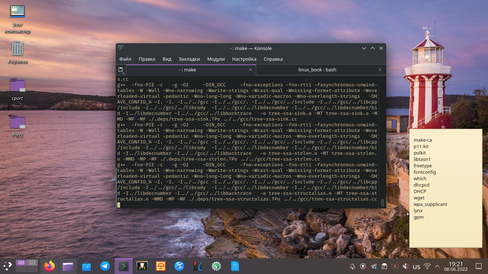
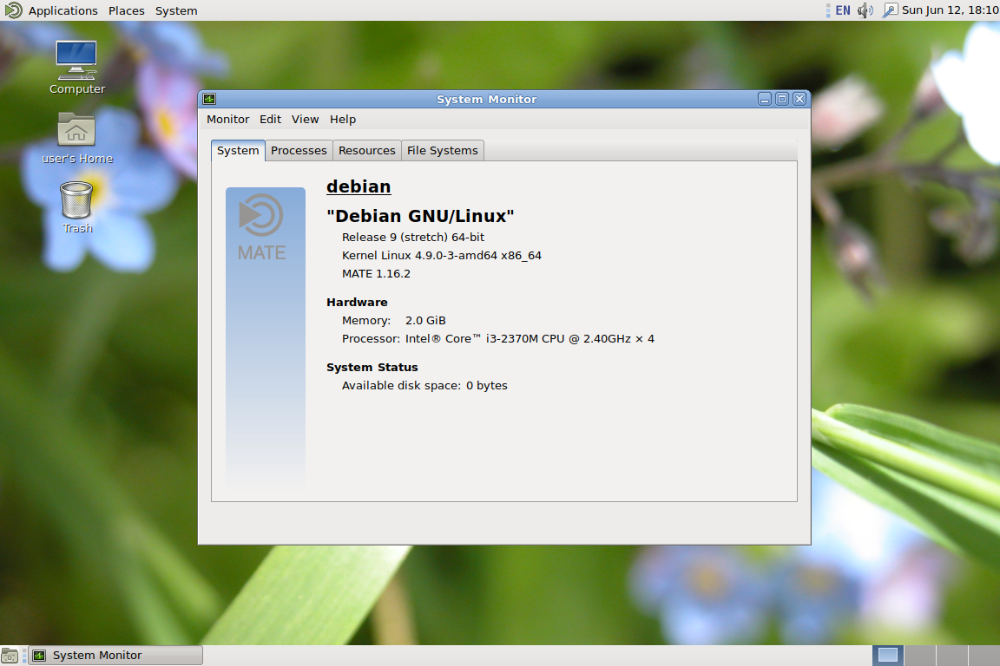
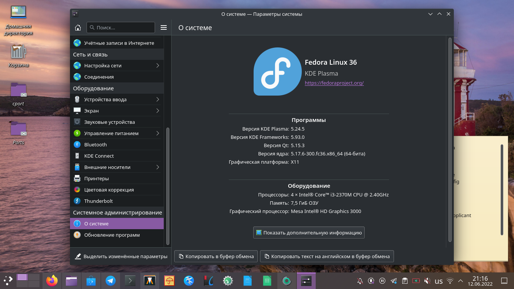
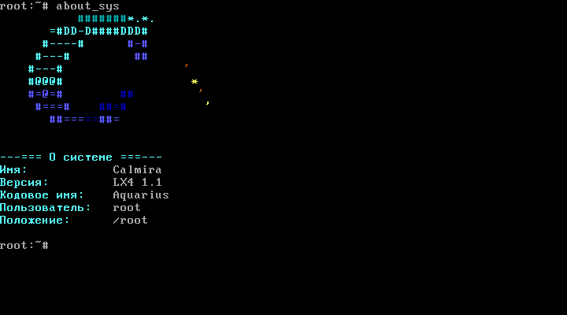

# Краткий обзор дистрибутивов GNU/Linux

Существует очень большое число дистрибутивов этой операционной системы, имеющие
своё предназначение. Какие-то предназначены для работы на устаревшем
оборудовании, другие применяются на серверах, а какие-то оптимизированы для
игровых ПК. В списке ниже представлены основные дистрибутивы GNU/Linux.

Но, если быть честным, то большое число дистрибутивов GNU/Linux мало чем
отличаются друг от друга. Странно, что большинство из них "хвалится" быстрой и
простой установкой, большим числом программного обеспечения и прочими вещами,
которые уже присутствуют в большинстве известных *крупных* дистрибутивах
GNU/Linux. Не могу не утверждать о том, что люди просто *любят* создавать
что-либо. Однако я ни в коем случае не утверждаю то, что создание своих
дистрибутивов и сборок (дистрибутив - это форма распространения программного
обеспечения. *прим. автора*) - это что-то очень плохое и непозволительное.
Например, мой знакомый работает системным администратором, и ему пришлось
установить на довольно большое число ПК ту или иную систему GNU/Linux, а
впридачу к этому, каждую из установленных систем должным образом настроить и
установить требуемое ПО. И для упрощения работы он создал сборку одного из уже
существующих дистрибутивов, где всё нужное было настроено и установлено.

Мне тоже понадобился простой и лёгкий дистрибутив GNU/Linux без ненужных мне
вещей и только со свободным ПО. Так и появился дистрибутив Calmira
GNU/Linux(-libre), о котором далее. Его я собрал с нуля из исходного кода по
LFS. И первоначально я не планировал его кому-то распространять, а сделал только
для себя. Но народ заинтересовался этой системой, в результате чего вы можете
скачать эту систему с моего сайта.

## Debian

Debian GNU/Linux - это один из самых старых дистрибутивов GNU/Linux. Самым
главным для себя его разработчики ставят создание свободной и надёжной системы.
И правда - Debian содержит в себе свободное ПО, а также является достаточно
надёжным и отказоустойчивым. Но увы - за всё в жизни приходится платить, и плата
на надёжность и стабильность - достаточно устаревшее программное обеспечение в
версии системы, признанной стабильной. Например, в Debian 11, последней версии
системы на момент написания этого руководства, присутствует рабочее окружение
GNOME версии 3.38, когда как на момент релиза этой системы уже существовал GNOME
41, а на момент написания этого руководства уже 42 версия, и уже готовится
43я[^1].

## Ubuntu

Ubuntu была основана на нестабильной ветке Debian GNU/Linux. Это достаточно
простая система, предназначенная для новичка в GNU/Linux, либо обычного
пользователя. Кроме того, есть редакция Ubuntu Server, из названия понятна
область применения той редакции.

Но у этого дистрибутива есть ряд недостатков. Например, агрессивная политика
CanoniCAL (разработчик Ubuntu) по навязыванию пользователям пакетов программного
обеспечения в формате *snap*. Это ужаснейший формат пакетов, который адекватные
люди вряд ли будут использовать. Кроме того, в Ubuntu полно инструментов для
слежки за пользователем (раньше "следили" только за поисковыми запросами,
сделанными в поиске системы, сейчас же шлют очень много информации о железе
компьютера и конфигурации ОС третьим лицам без согласия пользователя -
разработчики этой системы даже не предупреждают пользователя об этом!). Ну и
вообще Ubuntu любит многое решать за пользователя, что для свободного ПО -
моветон. Она автоматически обновляет *snap* пакеты без ведома пользователя, а
вместо обычных пакетов с браузерами Chromium и Firefox "тайно" устанавливается
именно snap, а не обычный пакет.

Кроме того это достаточно тяжеловесный дистрибутив GNU/Linux, который включает в
себя очень много ненужного, а некоторые вещи, используемые по умолчанию,
достаточно сомнительны. Ну и сама система не может похвастаться надёжностью.

Резюмируя, можно отметить, что для новичка в GNU/Linux эта система, может быть,
подойдёт, но у неё есть куча недостатков, которая для некоторых будет весомым
поводом не использовать Ubuntu у себя на ПК.

## Fedora, RHEL

Fedora - это дистрибутив, разрабатываемый сообществом при спонсорстве компании
Red Hat (которая разрабатывает корпоративный дистрибутив GNU/Linux - RHEL). В
нём одним из первых появляются современные решения, которые потом "растаскивают"
разработчики других систем. Из-за этого Fedora нередко называют "тестовым
полигоном Red Hat".

Эта система, как и предыдущая, также ориентирована на обычного пользователя, но
некоторые применяют её и в серверном оборудовании. Fedora также не отличается
особой надёжностью, но, в целом, работа лучше, чем в Ubuntu.

## Slackware

На сегодня это старейший из развивающихся дистрибутивов GNU/Linux, созданный
разработчиком Патриком Фолькердингом в начале девяностых. Это достаточно сложная
система для обычного пользователя, но проверенная временем и достаточно
надёжная. Кроме того, в отличие от приведённых выше Ubuntu и Fedora, в Slackware
большинство компонентов либо можно безболезненно заменить на альтренативы, либо
каким-то образом кастомизировать. Но если пользователь жаждет полного контроля
над системой и настоящей свободы действий, то, может быть, стоит переключиться
на следующий уровень: на Gentoo и LFS?

Slackware очень часто называют "самым UNIX'овым". Кроме того, не только
поклонники этого дистрибутива, но и многие пользователи других дистрибутивов
GNU/Linux высказываются о нём так:

> Если вы учите Red Hat, то вы узнаёте Red Hat, а если вы учите Slackware - вы
> узнаёте GNU/Linux.

Первая версия этого дистрибутива вышла 17 июля 1993 года, для сравнения - Debian
вышел примерно в то же время - 16 августа 1993.

## Gentoo

Source based дистрибутив GNU/Linux, в котором пользователь может контролировать
всё происходящее. Система очень хорошо задокументирована и поддерживает большое
количество программного обеспечения.

## LFS/[LX4U](https://lx4u.ru)

На самом деле, LFS и LX4U - это не дистрибутивы GNU/Linux, а *руководства*, по
которым пользователь с нуля из исходного кода собирает свой собственный
дистрибутив GNU/Linux. Собранная в итоге система, конечно, мало что умеет, ибо
набор программного обеспечения может показаться достаточно скудным. Однако такая
система содержит всё необходимое для сборки другого программного обеспечения,
которое нужно пользователю, а руководство BLFS содержит около 1000
дополнительных программ, среди которых библиотеки, ПО для разработки, рабочие
окружения, текстовые редакторы, браузеры и многое другое.

Но основными целями обоих руководств является изучение строения GNU/Linux, в
результате чего пользователь узнает, какое ПО используется для работы системы, а
также как это ПО взаимодействует друг с другом.

Здесь пользователь может диктовать каждый аспект своей системы. Например, я
работаю над системой [Calmira GNU/Linux-libre](https://github.com/CalmiraLinux),
в котором, как вы могли понять, вместо обычного ядра Linux используется ядро
Linux-libre. И таких примеров можно привести много.

---

## Основной дистрибутив, который будет описан на протяжении этого руководства

Я особо не выбирал дистрибутив, который следует здесь использовать в качестве
примера. Требовалась минимальная система, которая не содержит каких-то очень
"эксклюзивных" для неё компонентов. Кроме того, требовалась классическая
система без излишних для изучения усложнений. Выбор пал на дистрибутив
собственной сборки - Calmira GNU/Linux-libre, который точно подходит под моё
описание. Далее на протяжении всего руководства буду приводить примеры из этой
системы. Очень многое будет справедливо и для других дистрибутивов
GNU/Linux(-libre), а что-то и в достаточно изменённом виде.

[^1]: в GNOME после 3.38 версии идёт 40 версия (*прим. автора*).
