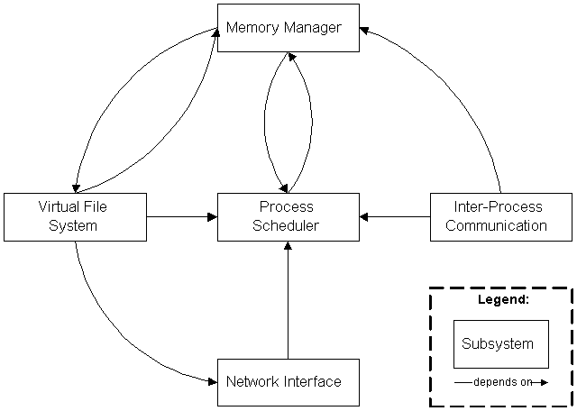

# Строение GNU/Linux 1. Начальные сведения

Данное руководство не является самоучителем вроде "Мой первый компьютер",
поэтому какие-то базовые вещи вроде сведений о BIOS, UEFI и прочем здесь
приведены не будут.

## Набор программного обеспечения

Операционная система состоит из ядра, утилит для обслуживания системы,
загрузчиков и прочего ПО, необходимого для работы ОС и являющегося её
неотъемлемой частью. Ричард Столлман настаивает на названии GNU/Linux, и вот
почему: Linux - это всего лишь ядро. Из одного ядра ОС не может состоять,
согласитесь? Операционная система состоит из компонентов GNU и, собственно,
самого ядра Linux. Далее приводится список некоторых жизненно важных приложений
как из состава GNU, так и из других проектов, для того, чтобы читатель понял,
что без GNU никакой операционной системы с ядром Linux, и никаких её
дистрибутивов вроде Debian, Fedora и прочих не было бы.

- Ядро Linux(-libre);
- Компоненты GNU:
    - glibc - библиотека С;
    - coreutils - основные утилиты, необходимые для работы UNIX-систем: `cat`,
      `ls`, `rm`, прочие;
    - grub - загрузчик системы;
    - make - продвинутая система сборки программного обеспечения;
    - gcc - компилятор C, C++ и других языков;
    - прочие утилиты;
- Система инициализации: systemd/SysVInit/etc.;
- Дополнительный системный софт:
    - shadow - пакет, содержащий программы для работы с паролями безопасным
      способом;
    - kmod - библиотеки и утилиты для управления модулями ядра;
    - util-linux - стандартный набор системных утилит для работы с файловой
      системой, консолью, разделами и прочим;
- Окружения пользователя:
    - Консольные Shells:
        - bash;
        - zsh;
        - fish;
        - tcsh;
        - и другие;
    - Графические рабочие окружения:
        - GNOME;
        - KDE;
        - MATE;
        - Xfce;
        - Cinnamon;

Остальное программное обеспечение может присутствовать или отсутствовать - это
зависит от конкретного дистрибутива. Кроме того, в данном списке не учитываются
зависимости программного обеспечения и некоторый другой менее известный, но не
менее значимый софт. В общей сложности, если подсчитать всё необходимое для
*минимального* дистрибутива GNU/Linux, который пригоден для какого-то
использования, настройки, и, что самое главное, сборки доп. софта (т.е. тот
дистрибутив GNU/Linux, который содержит необходимый софт для сборки ПО, такой,
как GCC, Make, patch, autotools и пр.), получится несколько десятков пакетов
ПО. У меня получилось около девяноста пакетов. LFS, руководство по созданию
своего *минимального* дистрибутива GNU/Linux с нуля из исходного кода, содержит
около 70 пакетов, но надо понимать, что LFS - это руководство по созданию
*минимальной* системы GNU/Linux, которая будет способна редактировать текстовые
файлы и собирать нужное ПО, не более. А уже пользователь самостоятельно
"доустанавливает" всё нужное после сборки LFS. А в том же дистрибутиве Fedora
36, на котором я начинал писать это руководство, в данный момент установлено
около четырёх тысяч пакетов.

??? note "Спойлер"
    Я даже не знаю, для чего мне добрая половина из того, что установлено, так
    как б**о**льшая часть пакетов является зависимостями других. Кроме того, не
    всё ещё можно удалить "безболезненно" для системы и другого ПО. Тут мне
    очень нравятся source-based дистрибутивы, в которых пользователь собирает
    всё сам и знает, что для чего нужно, а также контролирует каждое действие
    системы.


В данном списке я пропустил одну важную вещь, которую обычно называю
*дистрибутиво-ориентированным* программным обеспечением. Это такой софт, который
предназначен для конкретного дистрибутива GNU/Linux (и разрабатывается, как
правило, командой этого дистрибутива, в которую входят и разработчики, и
переводчики, и дизайнеры, да много кого). Ну и является, зачастую, системным,
так как предназначен для обслуживания этой системы и является её неотъемлемым
компонентом. Примером такого ПО может являться пакетный менеджер, главная задача
которого - управление программным обеспечением. Да, такое программное
обеспечение входит почти во все дистрибутивы GNU/Linux, но это не всегда.
Кроме того, дистрибутиво-ориентированный софт в некоторых случаях может быть
заменён другим (не всегда, но такая возможность иногда есть), либо задачи этого
ПО выполняет сам пользователь.

Как пример - программы `dpkg` и `apt` в Debian, которые необходимы для
управления программным обеспечением. Конечно, вместо apt вы можете использовать
ныне устаревший apt-get или разрабатываемый по сей день aptitude, но они
являются всего лишь надстройками над низкоуровневым `dpkg`, главной задачей
которых является скачивание пакетов из репозиториев и их установка в систему
посредством dpkg.

Кроме утилит для управления программным обеспечением есть и ПО для более
детальной настройки системы и её обслуживания. Например, YaST из openSUSE или
Alterator из Альт GNU/Linux. Если ПО для настройки конкретной системы - это
редкость, то вот наличие пакетного менеджера стало, считай, необходимым в любом
современном дистрибутиве GNU/Linux.

Раз уж я привёл пример пакетного менеджера, то продолжу о нём. Пакетные
менеджеры (ПМ) входят хоть и в большинство дистрибутивов, но не во все.
Представьте себе ситуацию, когда вы самостоятельно собрали себе свой дистрибутив
GNU/Linux по руководству LFS или LX4U. У вас там не будет никакого средства для
управления пакетами, вместо этого вы сами вручную будете собирать нужный вам
софт. Хотя соглашусь, что во всех, либо просто во многих известных нам системах,
такой софт активно используется.

## Описание некоторого программного обеспечения

Далее следует перейти к описанию каждой указанной программы в списке, и начну с
ядра Linux(-libre).

## Ядро ОС

Linux - это ядро операционной системы (GNU/Linux), обеспечивающее программному
обеспечению доступ к ресурсам компьютера, и предоставляющее наиболее низкий
уровень абстракции для доступа приложений к ресурсам системы, необходимым для
их работы. Как писал Таненбаум:

> Абстракция - это ключ к управлению сложностью.

Linux является монолитным ядром. Это классическая и наиболее распространённая
архитектура ядер ОС. Все части такого ядра работают в одном адресном
пространстве.

**Плюсы монолитных ядер:**

- Более прямой доступ к аппаратным средствам;
- Проще обмен данными между процессами;
- Процессы реагируют быстрее.

**Минусы монолитного ядра:**

- Большой размер;
- Более высокие требования к аппаратуре ПК, в частности, к ОЗУ;
- Менее безопасно.

Кроме того, монолитность усложняет разработку ядра (например, добавление новых
функций, избавление от легаси-кода[^1], унаследованного от старых версий,
отладку, etc.). Не следует забывать и про системные требования такого типа
ядер, поэтому использование ОС с ними неоправдано в ПК, ограниченных, например,
по объёму ОЗУ.

### Модули монолитных ядер как решение проблем пересборки

Раньше при любом изменении в аппаратуре ПК требовалось выполнять пересборку
монолитного ядра. Сейчас же Linux[^2] умеет динамически во время работы
подгружать и выгружать *модули*, выполняющие какие-либо функции. Пользователь
может подключать виртуализацию, какие-то другие из возможностей и прочее.

Для управления модулями в GNU/Linux используются программы из пакета `kmod`.

### Основные подсистемы ядра

1. **Process Scheduled** (SCHED) - планировщик процессов, отвечающий за контроль
   над доступом процессов к CPU. Планировщик обеспечивает такое поведение ядра,
   при котором все процессы имеют справедливый доступ к ЦП компьютера.
2. **Memory Manager** (MM) - менеджер памяти, обеспечивающий различным процессам
   безопасный доступ к основной памяти системы. Кроме того, MM обеспечивает
   работу виртуальной памяти, которая позволяет процессам использовать больше
   памяти, чем реально доступно в системе. Отдельные фрагменты памяти, как
   правило, неактивные, перемещаются из ОЗУ в другое хранилище, например,
   жёсткий диск (в раздел или файл подкачки), освобождая ОЗУ для загрузки других
   активных фрагментов памяти. Это называется *подкачкой страниц* или
   *swapping*.
3. **Virtual File System** (VFS) - виртуальная файловая система, создающая
   абстрактный слой, скрывающий детали оборудования, предоставляя общий файловый
   интерфейс для всех устройств. Кроме того, VFS поддерживает несколько форматов
   файловых систем, совместимых с другими ОС.
4. **Network Interface** (NET) - сетевые интерфейсы. Обеспечивает работу с
   различными сетевыми стандартами и сетевым оборудованием.
5. **Inter-Process Communication** (IPC) - межпроцессорная система,
   поддерживающая несколько механизмов для `process-to-process` связей в единой
   Linux-системе.



<p align="center">Структура ядра Linux и его основных компонентов.</p>

### Что тебе в имени моём?

<p align="right">Даже если проект GNU заслуживает благодарности за эту работу,
разве стоит спорить, когда люди не отдают должного? Разве важно не то, что
работа выполнена, а то, кто её проделал? Вы должны отдыхать, гордиться хорошо
выполненной работой и не беспокоиться о благодарностях.</p>

Как вишню не назови, вишней она быть не перестанет. Но если вы назовёте вишню
яблоней, то многие (адекватные) люди разочаруются, попытавшись найти там яблоки.
Также и у нас: Linux - это название *ядра*, а GNU/Linux - *операционной
системы*. Такая ОС включает в себя компоненты GNU (например, coreutils, grub,
make, gcc, gdb, awk и прочие), а также ядро Linux.

Кроме GNU/Linux существует ещё и GNU/Hurd и, может быть, что-то ещё. Вы же
используете тот, или иной дистрибутив GNU/Linux. Под словом "*дистрибутив*"
подразумевается *форма распространения программного обеспечения*.

## Компоненты GNU

Здесь не будут упомянуты всё программное обеспечение, написанное в рамках
проекта GNU, так как его очень много, а цель данного руководтства - являться
кратким введением в GNU/Linux, не более. Здесь будут описаны только самые важные
компоненты системы, которые являются компонентами GNU.

### Glibc

Glibc - это библиотека C, которая обеспечивает системные вызовы и основные
функции, среди которых `open()`, `malloc()`, `printf()` и прочие. Эта
библиотека используется во многих дистрибутивах GNU/Linux, когда как в
некоторых её заменяют на альтернативы, например, на musl.

Написана Фондом Свободного ПО в рамках проекта GNU, распространяется под
лицензией GNU LGPL.

Некоторые критикуют glibc за то, что она "раздута" и довольно медленна по
сравнению с её аналогами.

### coreutils

Этот пакет программного обеспечения содержит основные утилиты, среди которых
`cat`, `ls` `rm` и прочие, необходимые для UNIX систем. Ниже приведена таблица с
наиболее используемым ПО из этого пакета.

| Программа    | Описание                                           |
|:------------:|----------------------------------------------------|
| `chgrp`      | Изменяет группу владельца файла                    |
| `chmod`      | Изменяет права доступа к файлу                     |
| `chown`      | Изменяет владельца файла                           |
| `cp`         | Копирует файлы                                     |
| `mv`         | Перемещает файлы                                   |
| `ln`         | Создаёт ссылку на файл                             |
| `dd`         | Низкоуровневое копирование и преобразование файлов |
| `df`         | Отображает свободное место в носителях информации  |
| `ls`         | Просматривает содержимое директорий                |
| `mkdir`      | Создаёт директории                                 |
| `rm`         | Удаляет файлы и директории                         |
| `rmdir`      | Удаляет пустые директории                          |
| `cat`        | Конкатенация и вывод содержимого файлов в stdout   |
| `wc`         | Выводит кол-во слов, строк и размер файла          |
| `chroot`     | Изменяет корневую директорию                       |
| `du`         | Оценивает свободное место в носителях информации   |
| `false`      | Возвращает значение "ложь"                         |
| `true`       | Возвращает значение "истина"                       |
| `pwd`        | Выводит текущий рабочий каталог                    |
| `sleep`      | Задерживает выполнение на некоторое время          |
| `tee`        | Отправляет вывод на множество файлов               |
| `uname`      | Выводит информацию о системе                       |
| `uptime`     | Выводит время использования системы                |
| `test` / `[` | Проверяет всевозможные условия                     |

## Основные части дистрибутива GNU/Linux

Вкратце, дистрибутив GNU/Linux можно разделить на следующие компоненты:

1. Собственно, само ядро Linux или Linux-libre[^3], создающее абстрактный слой и
   являющееся "посредником" между ПО и hardware-частью компьютера.
2. **Hardware Controllers** (контроллеры оборудования) - подсистема,
   охватывающая всевозможные физические устройства, такие, как CPU, RAM, жёсткие
   диски и прочее.
3. **OS Services** (службы операционной системы) - службы, которые обычно
   являются частью ОС.
4. **User Applications** (пользовательские приложения) - набор пользовательского
   ПО, который может различаться от дистрибутива к дистрибутиву GNU/Linux. Кроме
   того, сами пользователи могут изменять набор этого ПО в зависимости от своих
   целей и предпочтений.


<p align="center">Структура типичного дистрибутива GNU/Linux</p>

Каждая подсистема может взаимодействовать только с двумя соседними,
расположенными непосредственно "выше" и "ниже" её уровня. Кроме того,
зависимости между этими подсистемами направлены сверху вниз: слои, расположенные
выше, зависят от частей ниже, но части, расположенные ниже, не зависят от частей
выше них.

## Структура директорий по FHS

FHS (Filesystem Hierarchy Standard) - это стандарт, как вы уже могли понять,
расположения системных директорий и файлов системы. Он относится не только к
GNU/Linux, но и ко многим другим UNIX-системам. Важно отметить, что есть такие
системы, как Gobo GNU/Linux, которые не следуют этому стандарту, они здесь не
рассматриваются.

```
/	корень
|--- /bin	основные утилиты, необходимые как в однопользовательском режиме, так
|           и при обычной работе
|--- /boot	загрузочные файлы (собственно, файлы загрузчика, ядро, et cetera)
|--- /dev	файлы устройств (например, /dev/sda, /dev/sdb, et cereta)
|--- /etc	конфигурационные файлы системы
|    |--- /etc/opt	конфиги для /opt/*
|    |--- /etc/X11	конфиги X Window
|    |--- ...
|--- /home	содержит домашние каталоги пользователей, где юзеры хранят свои
|           файлы, настройки системы, специфичные для каждого пользователя
|           и т.п.
|--- /lib	основные библиотеки, необходимые для работы ПО из /bin и /sbin
|--- /media	точки монтирования сменных носителей
|--- /mnt	временно монтируемые ФС
|--- /opt	дополнительное ПО. Например, именно туда устанавливается легендарное
|           рабочее окружение TDE.
|--- /proc	виртуальная ФС, предоставляющая информацию о состоянии ядра ОС и
|           запущенных процессах в виде файлов
|--- /root	домашний каталог пользователя root
|--- /sbin	основные системные программы для настройки и администрирования
|           системы (init, ifconfig, mkfs, et cereta)
|--- /srv	данные для сервисов, предоставляемых системой
|--- /sys	содержит информацию об устройствах, драйверах и пр.
|--- /tmp	временные файлы, некоторые из них удаляются перед выключением
|           системы
|--- /usr	вторичная иерархия для данных пользователя. Содержит большинство
|           пользовательских приложений и утилит, используемых в
|           многопользовательском режиме
|    |--- /usr/bin	дополнительное ПО для всех пользователей
|    |--- /usr/include	стандартные заголовочные файлы
|    |--- /usr/lib	библиотеки для программ из /usr/bin и /usr/sbin
|    |--- /usr/local	третичная иерархия для данных, специфичных для данного
|                       хоста, содержит директории bin, lib, share, et cetera
|    |--- /usr/share	архитектурно-независимые файлы
|    |--- /usr/sbin	дополнительные системные программы (см. также: /sbin)
|    |--- /usr/src	исходные тексты ПО
|--- /var	изменяемые файлы, такие как кеш приложений и ПМ, логи и прочее
|    |--- /var/log	логи ядра, операционной системы и ПО
```

### Независимые классификации FHS

Спецификация FHS основывается на идее существования двух независимых
классификаций файлов: разделяемых и неразделяемых, а также изменяемых и
статичных. Разделяемые файлы могут распространяться на несколько хостов, а
неразделяемые специфичны для конкретного хоста (например, конфиги).
Соответственно, изменяемые файлы изменяются (здравствуй, капитан Очевидность), а
статичные - нет (за исключением установки и обслуживания системы).

Резюмируя - 4 возможные комбинации + нужные директории.

| --             | Разделяемые    |   Неразделяемые |
|:---------------|:--------------:|:---------------:|
| **Статичные**  | `/usr`, `/opt` | `/etc`, `/boot` |
| **Изменяемые** | `/var/main`    | `/var/run`      |

[^1]: легаси-код - устаревший код (*прим. автора*)

[^2]: в данном руководстве речь идёт только о ядре Linux и операционной системе
  GNU/Linux

[^3]: различия этих двух ядер (весьма небольшие) будут даны позже
