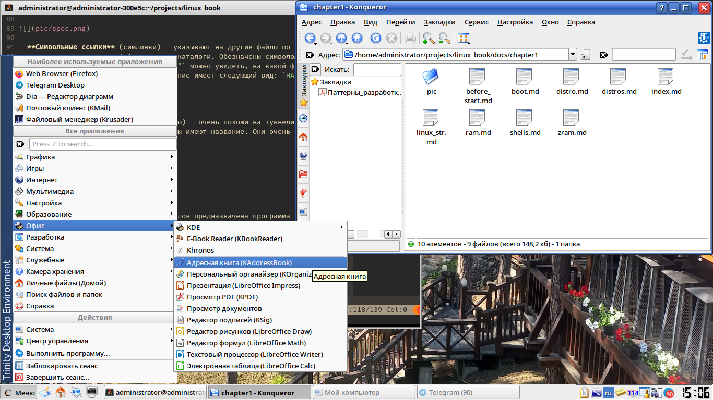

# Краткий обзор графических окружений пользователя и консольных командных оболочек

## Графические пользовательские окружения

Графические окружения пользователя состоят из нескольких частей. Первая из них -
это X сервер, обеспечивающий работу этих окружений.

Следующим элементом является *оконный менеджер* - window manager. Как можно
понять из названия, WM предназначен для управления окнами. Он может
использоваться как отдельно от рабочего окружения (DE - desktop environment),
определение которого будет дано в самом конце этого пункта, так и в составе DE.
Есть очень много "отдельных" WM, которые не входят в состав ни одного известного
рабочего окружения. Например, i3, Window Maker, Fluxbox, IceWM.

Некоторые WM включают в себя также возможность изменения обоев рабочего стола, а
также панель, на которой содержится список открытых окон и некоторые другие
элементы (кнопка для входа в главное меню системы, где приведён список
установленного ПО и прочие вещи, часы, системный трей, etc.). Например, Window
Maker имеет целую утилиту для настройки различных компонентов, док, содержащий
список открытых окон, а также способен расширять свой функционал посредством
мини-приложений, именуемых dockapp'ами.

Следующим элементом рабочего окружения является панель, на которой содержится
список открытых окон и другие элементы. Как правило, на панели можно изменять
набор установленных элементов, но есть рабочие окружения, такие, как GNOME, где
этого делать нельзя.

За управление файлами и работу иконок на рабочем столе отвечает файловый
менеджер (здравствуй, капитан Очевидность - *прим. автора*). Но в некоторых
рабочий окружениях работа иконок на рабочем столе осуществляется сторонним
компонентом (в KDE Plasma это *виджет*), а в некоторых иконки на рабочем столе
не поддерживаются вообще (например, в GNOME).

В рабочих окружениях также может присутствовать софт для просмотра и
редактирования текстовых файлов, терминал, мультимедиа софт и прочее ПО,
предназначенное для конкретного DE. Но есть и исключение: в разработке находится
рабочее окружение Ascetico, содержащее в себе независимое друг от друга
программное обеспечение. Это рабочее окружение ставит своей целью быть простым,
минималистичным и кастомизируемым.

Из всего вышеописанного следует, что *рабочее окружение* состоит из следующего
ПО:

- Дисплейный менеджер;
- Оконный менеджер;
- Панель;
- Файловый менеджер;
- Возможно, другое программное обеспечения для организации комфортной работы.

В части руководства, посвящённой процессу загрузки, о рабочих окружениях
написано подробнее.

Далее представлен список наиболее известных рабочих окружений.

### KDE

- **Оконный менеджер:** KWin
- **Файловый менеджер:** Dolphin
- **Терминал:** Konsole
- **Дисплейный менеджер:** SDDM
- **Поддержка Wayland:** Плохая
- **Кастомизация:** Очень хорошая

### GNOME

- **Оконный менеджер:** Mutter
- **Файловый менеджер:** Nautilus
- **Терминал:** GNOME Terminal/KGX (Console)
- **Дисплейный менеджер:** GDM
- **Поддержка Wayland:** Очень хорошая
- **Кастомизация:** Ограниченная

### Mate

- **Оконный менеджер:** Marco
- **Файловый менеджер:** Caja
- **Терминал:** MATE Terminal
- **Дисплейный менеджер:** lightdm
- **Поддержка Wayland:** Очень плохая/Отсутствует
- **Кастомизация:** Хорошая

### TDE (Trinity Desktop Environment)

- **Оконный менеджер:** TWin
- **Файловый менеджер:** Konqueror
- **Терминал:** Konsole
- **Дисплейный менеджер:** TDM
- **Поддержка Wayland:** Отсутствует
- **Кастомизация:** Очень хорошая

## Консольные командные оболочки

- BASH - "тот самый". Используется в большинстве дистрибутивов GNU/Linux;
- sh;
- ash;
- zsh - продвинутая оболочка с автодополнением и прочими моднейшими вещами.
  Возможно использование всевозможных расширений;
- fish;
- dash - обычная оболочка из Debian GNU/Linux;
