# Типы файлов

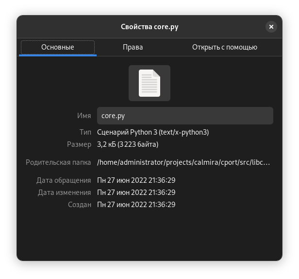

## Всё есть файл

Концепция "Всё есть файл" была перенята разработчиками ядра Linux из UNIX. Это
было сделано для предоставления простого доступа ко всем возможностям ОС без
разработки отдельных костылей. Из этого следует, что преимущество этого принципа
заключается в том, что не надо реализовывать отдельные API для каждого
устройства, в результате чего с файлами могут работать все стандартные программы
и API-интерфейсы. В Linux, как было написано ранее, есть корневая ФС, куда
монтируются раздел жёсткого диска, куда установлена ОС, другие разделы, флешки,
диски, etc.

Кроме того, в UNIX и, соответственно, GNU/Linux, как таковое понятие
"расширения" не совпадает с таким же понятием из Windows. Т.е. расширение файла
в GNU/Linux и прочих UNIX-подобных системах не используется для определения типа
файла.

Если вам надо быстро узнать информацию о типе файла, используйте программу
`file`. Например, просмотрим информацию о файле `/etc/os-release`:

```bash
file /etc/os-release
```

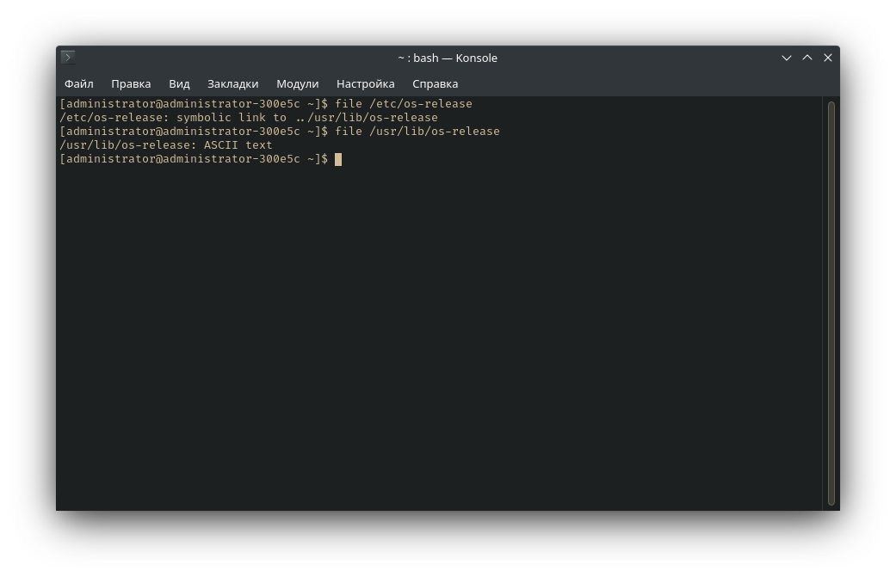

Самое яркое представление принципа "всё есть файл" - устройства. Загляните в
директорию `/dev`:

```bash
ls /dev
```

Здесь содержатся файлы для всех устройств: флешки, мыши, клавиатуры, микрофоны,
жёсткие диски и пр.

А теперь посмотрите информацию о каком-либо файле в `/dev`:

```bash
file /dev/sda2
```

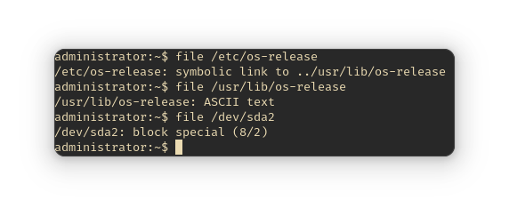

В таких файлах содержатся двоичные файлы, поэтому их открытие в каком-либо
текстовом файле бессмысленно.

## Типы файлов

- **Обыкновенные** - используются для хранения обычной информации;
- **Специальные** - для туннелей и устройств;
- **Директории** - их ещё называют *папками* или *каталогами*.

### Обыкновенные

С обычными файлами пользователь работает чаще всего. Это документы, текстовые
файлы, музыка и пр.

```bash
ls -l /etc | grep "^-"
```

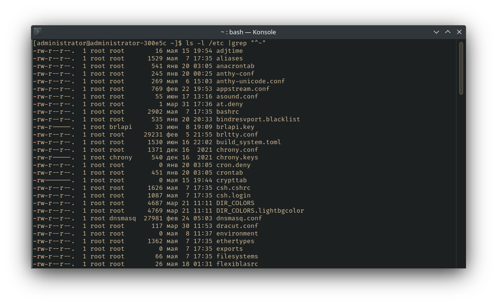

**Объяснение команды**

- `ls` просматривает содержимое [в данном случае] директории `/etc`, а ключ `-l`
  добавляет отображение дополнительных сведений о правах доступа к файлу,
  владельце, дате изменения/создания.

!!! note "Смотрите также"
    `man ls`

    `man grep`

### Специальные

Специальные файлы обеспечивают обмен информации с ядром, работу с устройствами и
пр. Собственно, делятся ещё на несколько типов:

- **Символьные файлы** - любые специальные системные, например, `/dev/null`,
  либо периферийные устройства (последовательные/параллельные порты). Такие
  файлы идентифицируются символом `c`.
- **Блочные** - периферийные устройства, но в отличие от предыдущего типа,
  содержание блочных файлов буферизируется. Эти файлы идентифицированы символом
  `b`.

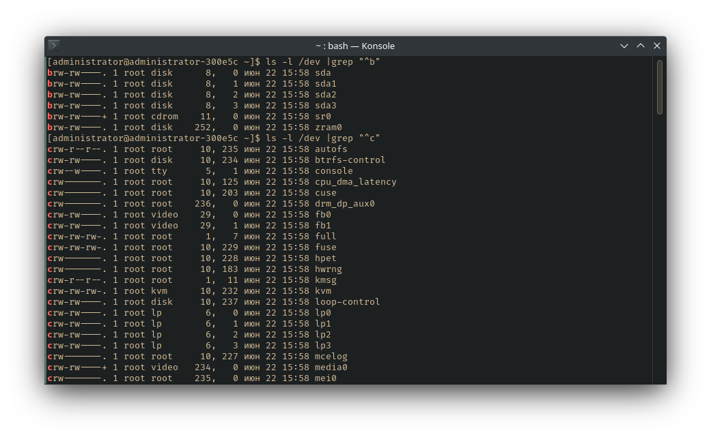

- **Символьные ссылки** (симлинки) - указывают на другие файлы по их имени,
  указывать и на другие файлы, в т.ч. каталоги. Обозначены символом `l`. В
  выводе команды `ls -l ... | grep "^l"` можно увидеть, на какой файл ссылаются
  симлинки - в последней колонке название имеет следующий вид: `НАЗВАНИЕ ФАЙЛА
  -> НА ЧТО ССЫЛАЕТСЯ`.

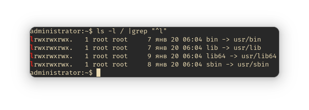

- **Туннели** (канал/именованные каналы) - очень похожи на туннели из Shell, но
  разница в том, что именованные каналы имеют название. Они очень редки,
  обозначены символом `p`.


## Пару слов про inode

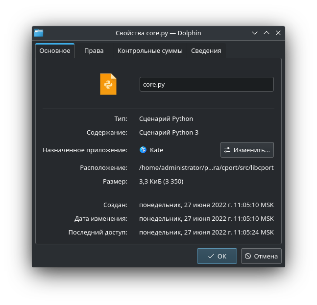

> При написании этого пункта я воспользовался материалами
> [статьи](https://habr.com/ru/post/462849/) на Habr'e.

inode - это структура данных, в которой содержится информация о файле или
директории в файловой системе. В ФС у файла есть не только само его
содержимое, но и метаданные, такие как имя, дата создания, доступа,
модификации и права доступа пользователей к этому файлу. Эти метаданные и
содержатся в inode'ах.

inodes хранит метаданные для каждого файла в системе в виде таблицы,
расположенной в начале раздела.

> inode - это структура данных, которая хранит всю информацию о файле кроме
> его имени и его фактических данных.

Эти метаданные, повторюсь, содержат всю необходимую информацию о файле за
исключением того, что указано выше (согласно POSIX):

- Размер файла (в байтах);
- ID устройства, содержащего файл;
- ID пользователя-владельца файла;
- ID группы файла;
- Права доступа к файлу;
- Дата последнего изменения inode (ctime - *change time*), последней
  модификации файла (mtime - *modification time*) и последнего доступа к
  файлу (atime - *access time*);
- Счётчик ссылок, указывающий на количество жёстких ссылок, указывающих на
  индексный дескриптор;
- Блоки диска, в которых находится содержимое файла.

Каждый используемый inode ссылается на 1 файл. Каквы уже поняли -
директории, блочные устройства и прочее - это тоже файлы. У каждого из них есть
1 индекс.

idodes уникальны на уровне разделов. Вы можете иметь два файла с одинаковым
номером inode в том случае, если эти файлы находятся в разных разделах.

Начнём с файловой системы, и в нашем случае будет ext4. Файловые системы ext
используют блоки для хранения файлов. В начале раздела расположен суперблок, в
котором находятся метаданные всей файловой системы, а за ним идут несколько
зарезервированных блоков, затем таблица inode и после неё блоки с данными.

Посмотреть, какой размер блока у вас можно следующей командой:

```bash
~:# blockdev --getpbsz /dev/sda2
512
```

Раздел `/dev/sda2` отформатирован в ext4, по умолчанию размер блока - 4096 байт.
Просмотреть информацию о файловой системе можно командой:

```bash
tune2fs -l /dev/sda2
```

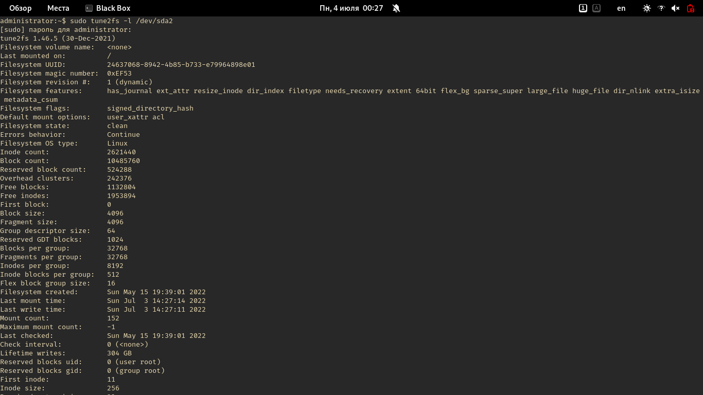

Предположим, что у нас есть файл `/home/administrator/tmp/test`. Файл
состоит из одного/нескольких блоков ФС, в которых содержатся его данные. Мы
знаем имя файла, а как его найти, какие читать *блоки*?

Как раз для этих целей и предназначены inode. Количество inode в нашем
случае (при использовании файловой системы ext4) задаётся при создании этой
ФС. В выводе `tune2fs` мы видели параметр `Inode count:`, который в моём
случае равен 2621440. Как раз в inode и содержится информация и о списке
блоков файловой системы для нужного нам файла.

Соответствие имени и номера inode содержится в каталоге, а каталог - это тоже
файл, но отобого типа. Понятное дело, что и директории имеют свой номер
inode. Для корневой директории (`/`) номер inode фиксированный, он равен 2.

Посмотрим содержимое inode №2:

```bash
debugfs /dev/sda2
```

У вас появится приглашение к вводу:

```
debugfs 1.46.5 (30-Dec-2021)
debugfs:  
```

Введите команду `stat <2>`:

<div class="highlight"><pre><span></span><code><span class="linenos" data-linenos="1 "></span><i><b>debugfs:</b></i> stat &lt;2&gt;
</code></pre></div>

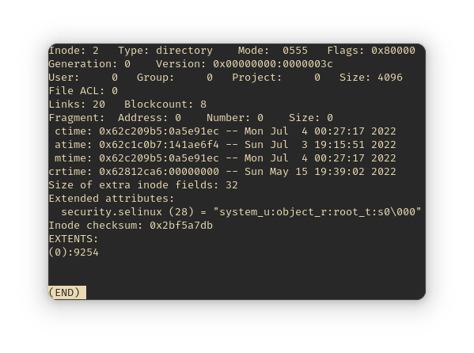

Нужная нам директория содержится в блоке 9254.

### Играемся с файловыми системами

Выше я написал, что нужное кол-во inode создаётся автоматически при создании
файловой системы. Однако пользователь самостоятельно может указать их нужное
количество:

```bash
mkfs -t ext4 -N кол_во /dev/sda2
```

Где `кол_во` - это количество inode.

Вы можете не указывать их точное количество, а указать байты в одном inode:

```
mkfs -t ext4 -i 3K /dev/sda2
```

### Почему может возникнуть ошибка записи?

Если не останется свободных блоков файловой системы, то при попытке
создания нового файла вы сможете лицезреть ошибку записи. В предыдущем
скриншоте (вывод `tune2fs`) вы видели параметр `Reserved block count:` (у меня
значение = 524288). Это блоки, доступные для записи только пользователю
`root`. Однако как решение "ошибки записи" вы можете сделать их доступными для
всех:

```
tune2fs -m 0 /dev/sda2
```

Может быть такая ситуация, когда свободные блоки есть, а inode кончились. Такое
случается тогда, когда в файловой системе много файлов меньше размера блока
файловой системы. Если мы будем учитывать то, что на 1 файл/директорию
рассчитан 1 inode, а всего их имеем 2621440 (`Inode count`), то данное
поведение вполне объяснимо. Если вы хотите увидеть это наглядно, выполните:

```bash
df -hi
```

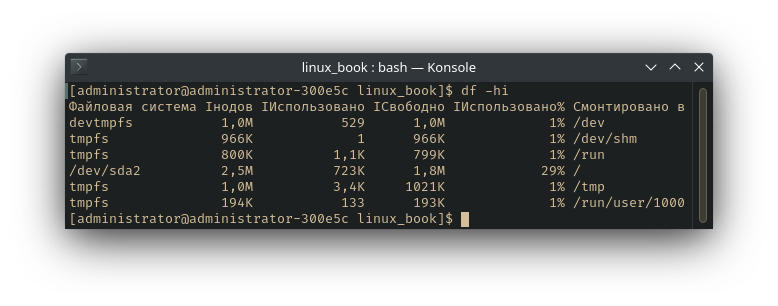

## Информация о файлах

### LSOF

Для просмотра списка всех открытых файлов предназначена программа `lsof` - List
Open Files. Эта информация поможет узнать о многом происходящем в системе, об
устройстве и работе Linux, а так же решить всевозможные проблемы, например,
когда вы не можете размонтировать раздел жёсткого диска из-за того, что
устройство используется, но вы не можете найти, какой именно программой.

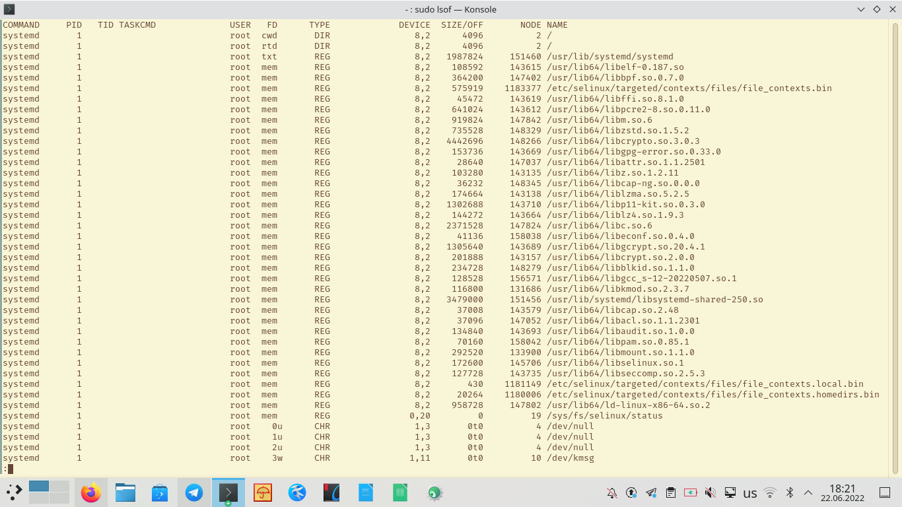

Вывод `lsof` состоит из нескольких колонок с информацией:

- `COMMAND` - имя команды, которая открыла или использует файл;
- `PID` - PID процесса;
- `TID` - идентификационный номер задачи (потока). Пустой столбец означает, что
  это не задача, а процесс;
- `TASKCMD` - имя команды задачи. Обычно имеет тоже самое название, что и
  процесс, указанный в столбце `COMMAND`, но некоторые реализации задач
  (например, в Linux) позволяют изменить имя своей команды;
- `USER` - имя пользователя, которому соответствует процесс, либо тот
  пользователь, которому принадлежит `/proc`, откуда lsof берёт информацию о
  процессе.
- `FD` - показывает файловый дескриптор;
- `TYPE` - тип узла, связанного с файлом;
- `DEVICE` - содержит номера устройств, разделённые запятыми, для специальных
  символьных, специальных блочных, обычных файлов/каталогов или NFS. Также
  может отображаться базовый адрес или имя устройства с сокетом Linux AX.25;
- `SIZE/OFF` - размер файла/смещение файла в байтах
- `NODE` - показывает номер узла локального файла или номер узла NFS-файла на
  хосте сервера или тип интернет-протокола. Может отображаться STR для потока,
  IRQ или номер инода устройства с сокетом Linux AX.25
- `NAME` - имя имя точки монтирования и файловой системы, в которой находится
  файл

### Опции LSOF

- `-u` - список файлов, открытых конкретным пользователем. Например, список
  открытых файлов пользователем `administrator`:

```bash
lsof -u administrator
```

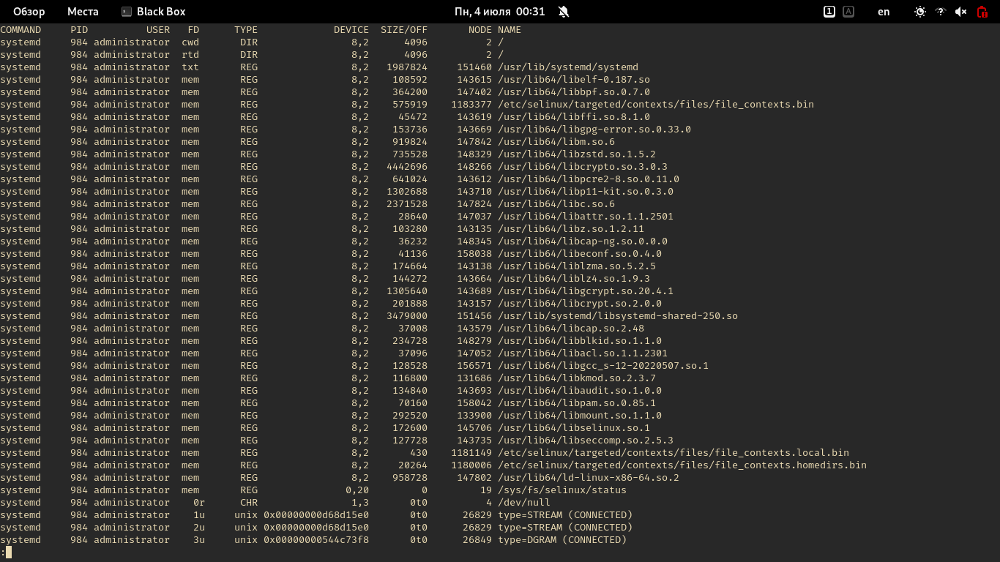

- `-U` - вывести все файлы сокетов домена UNIX:

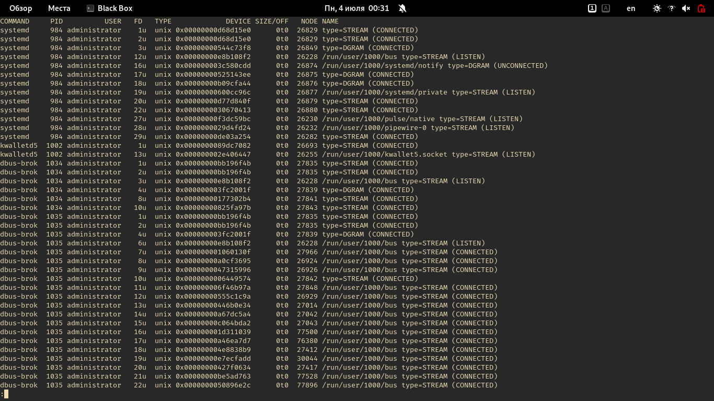

- `+d` - выяснить, какие каталоги и файлы открыты в некоей директории (но не её
  поддиректориях): `lsof +d /usr/bin`
- `-d` - задать список дескрипторов файлов, разделённых запятой, которые надо
  включить в вывод или исклбчить из него.

> Список исключается из вывода, если все записи в наборе начинаются со знака
> `^`. Список будет включён в вывод, если ни одна запись не начинается с `^`.
> Смешивание записей разных видов не разрешается.

> В списке может присутствовать диапазон номеров дескрипторов файлов при
> условии, что ни один из его членов не пуст, оба члена являются числами, и
> завершающий член больше начального - то есть: "0-7" или "3-10".

> Диапазоны могут быть использованы для исключения записей из вывода, если
> перед ними стоит префикс `^`, т.е. `^0-7` исключает все дескрипторы с 0 по 7.

- `-p` - вывести все файлы, открытые процессом с указанным при вызове команды
  PID.
- etc! Смотрите также: `man lsof`
