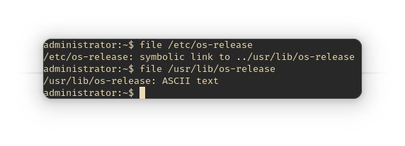
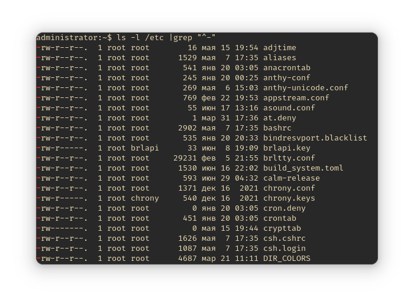
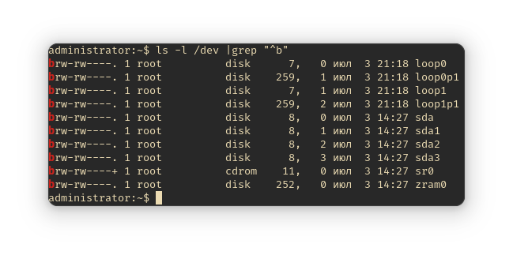
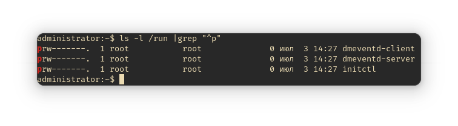

# Типы файлов

## Всё есть файл

Концепция "Всё есть файл" была перенята разработчиками ядра Linux из UNIX. Это
было сделано для предоставления простого доступа ко всем возможностям ОС без
разработки отдельных костылей. Из этого следует, что преимущество этого принципа
заключается в том, что не надо реализовывать отдельные API для каждого
устройства, в результате чего с файлами могут работать все стандартные программы
и API-интерфейсы. В Linux, как было написано ранее, есть корневая ФС, куда
монтируются раздел жёсткого диска, куда установлена ОС, другие разделы, флешки,
диски, etc.

Кроме того, в UNIX и, соответственно, GNU/Linux, как таковое понятие
"расширения" не совпадает с таким же понятием из Windows. Т.е. расширение файла
в GNU/Linux и прочих UNIX-подобных системах не используется для определения типа
файла.

Если вам надо быстро узнать информацию о типе файла, используйте программу
`file`. Например, просмотрим информацию о файле `/etc/os-release`:

```bash
file /etc/os-release
```



Самое яркое представление принципа "всё есть файл" - устройства. Загляните в
директорию `/dev`:

```bash
ls /dev
```

Здесь содержатся файлы для всех устройств: флешки, мыши, клавиатуры, микрофоны,
жёсткие диски и пр.

А теперь посмотрите информацию о каком-либо файле в `/dev`:

```bash
file /dev/sda2
```


В таких файлах содержатся двоичные файлы, поэтому их открытие в каком-либо
текстовом файле бессмысленно.

## Типы файлов

- **Обыкновенные** - используются для хранения обычной информации;
- **Специальные** - для туннелей и устройств;
- **Директории** - их ещё называют *папками* или *каталогами*.

### Обыкновенные

С обычными файлами пользователь работает чаще всего. Это документы, текстовые
файлы, музыка и пр.

```bash
ls -l /etc | grep "^-"
```



**Объяснение команды**

- `ls` просматривает содержимое [в данном случае] директории `/etc`, а ключ `-l`
  добавляет отображение дополнительных сведений о правах доступа к файлу,
  владельце, дате изменения/создания.

!!! note "Смотрите также"
    `man ls`

    `man grep`

### Специальные

Специальные файлы обеспечивают обмен информации с ядром, работу с устройствами и
пр. Собственно, делятся ещё на несколько типов:

- **Символьные файлы** - любые специальные системные, например, `/dev/null`,
  либо периферийные устройства (последовательные/параллельные порты). Такие
  файлы идентифицируются символом `c`.
- **Блочные** - периферийные устройства, но в отличие от предыдущего типа,
  содержание блочных файлов буферизируется. Эти файлы идентифицированы символом
  `b`.



- **Символьные ссылки** (симлинки) - указывают на другие файлы по их имени,
  указывать и на другие файлы, в т.ч. каталоги. Обозначены символом `l`. В
  выводе команды `ls -l ... | grep "^l"` можно увидеть, на какой файл ссылаются
  симлинки - в последней колонке название имеет следующий вид: `НАЗВАНИЕ ФАЙЛА
  -> НА ЧТО ССЫЛАЕТСЯ`.


- **Туннели** (канал/именованные каналы) - очень похожи на туннели из Shell, но
  разница в том, что именованные каналы имеют название. Они очень редки,
  обозначены символом `p`.



## Информация о файлах

### LSOF

Для просмотра списка всех открытых файлов предназначена программа `lsof` - List
Open Files. Эта информация поможет узнать о многом происходящем в системе, об
устройстве и работе Linux, а так же решить всевозможные проблемы, например,
когда вы не можете размонтировать раздел жёсткого диска из-за того, что
устройство используется, но вы не можете найти, какой именно программой.


Вывод `lsof` состоит из нескольких колонок с информацией:

- `COMMAND` - имя команды, которая открыла или использует файл;
- `PID` - PID процесса;
- `TID` - идентификационный номер задачи (потока). Пустой столбец означает, что
  это не задача, а процесс;
- `TASKCMD` - имя команды задачи. Обычно имеет тоже самое название, что и
  процесс, указанный в столбце `COMMAND`, но некоторые реализации задач
  (например, в Linux) позволяют изменить имя своей команды;
- `USER` - имя пользователя, которому соответствует процесс, либо тот
  пользователь, которому принадлежит `/proc`, откуда lsof берёт информацию о
  процессе.
- `FD` - показывает файловый дескриптор;
- `TYPE` - тип узла, связанного с файлом;
- `DEVICE` - содержит номера устройств, разделённые запятыми, для специальных
  символьных, специальных блочных, обычных файлов/каталогов или NFS. Также
  может отображаться базовый адрес или имя устройства с сокетом Linux AX.25;
- `SIZE/OFF` - размер файла/смещение файла в байтах
- `NODE` - показывает номер узла локального файла или номер узла NFS-файла на
  хосте сервера или тип интернет-протокола. Может отображаться STR для потока,
  IRQ или номер инода устройства с сокетом Linux AX.25
- `NAME` - имя имя точки монтирования и файловой системы, в которой находится
  файл
