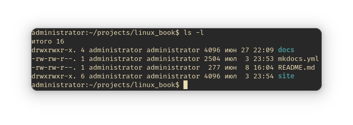
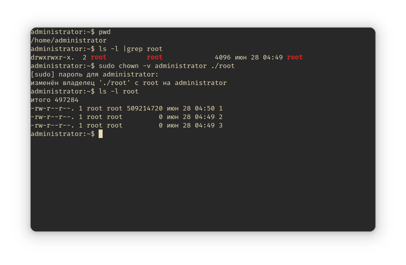
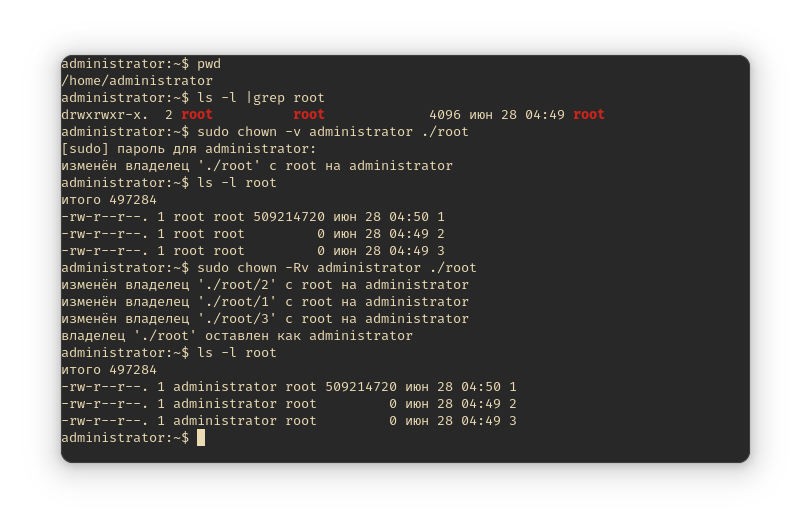
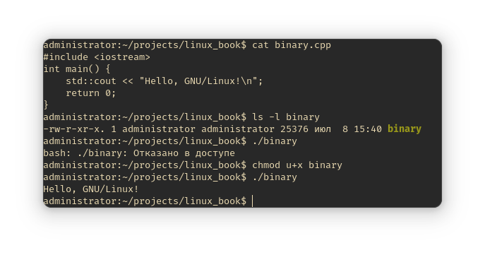
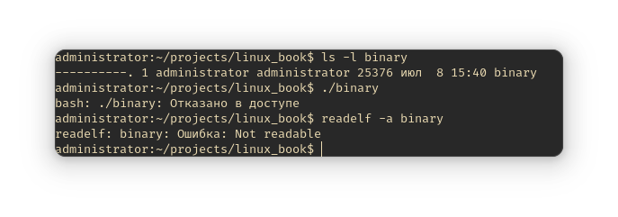

# Права доступа к файлам

## Введение

Окунёмся в историю. Операционная система UNIX проектировалась как многозадачная
и многопользовательская. Был суперпользователь (`root`), а также множество
других, у которых, как правило, доступ к системе был м*е*ньшим. Каждый
пользователь имел свои файлы. Представьте, что было бы, если не существовало
никакой системы контроля доступа к определённым файлам. Был бы полный хаос.
Сейчас объясню.

Предположим, что у нас есть два пользователя: `user1` и `user2`. Они пользуются
какой-либо UNIX системой, но в которой нет контроля доступа к файлам. У этих
двух пользователей есть свои файлы (документы, например), а также они имеют
полный контроль над операционной системой: могут читать её файлы, модифицировать
и удалять.

`user1` хочет прочитать какой-либо файл пользователя `user2`, но тот этого не
желает, так как в том файле содержится какая-либо конфиденциальная информация,
которую он хочет скрыть от `user1`, либо просто не хочет, чтобы у `user1` был к
ней доступ.

Но `user1` пошёл далее. После того, как он прочитал содержимое какого-то файла,
содержащегося в домашнем каталоге пользователя `user2`, он решил "набедокурить"
в системе и удалил директорию `/bin`, в котором содержится базовое программное
обеспечение, доступное как в однопользовательском режиме, так и в обычном
многопользовательском. Как итог - операционная система сломана и восстановить её
будет довольно затруднительно (особенно когда никто из пользователей не помнит
точного списка файлов, что присутствовал в `/bin`!).

Как вы уже могли понять, чтобы защитить как операционную систему, так и её
пользователей, от такого "непрошенного" доступа к файлам и предназначены права
доступа. GNU/Linux - это UNIX-подобная операционная система. Из UNIX в ней было
позаимствовано многое, в том числе и управление правами.

## Начальные теоретические сведения

В GNU/Linux используются разрешения, которые назначаются трём объектам: *файлу*,
*группе* и другому объекту, т.е. всем остальным.

У каждого файла есть два владельца: пользователь и группа. Они устанавливаются
при создании файла. Каждый файл имеет три категории пользователей, для которых
можно устанавливать разные сочетания прав дсотупа:

- **Владелец** - набор прав для владельца файла - пользователя, который создал
  его или сейчас установлен его владельцем. Обычно владелец имеет все 3 права:
  `чтение`, `запись` и `исполнение`.
- **Группа** - любая группа пользователей, существующая в ОС и привязанная к
  файлу.
- **Остальные** - все пользователи, кроме владельца и тех, кто входит в группу
  файла.

> Только пользователь `root` (он же суперпользователь) может работать со всеми
> файлами независимо от набора их полномочий.

Пользователь, создавший файл, становится его владельцем, также как и первичная
группа, в которую он входит. Чтобы определить, есть ли у вас, как у
пользователя, права доступа к файлу, оболочка проверяет владение им. Принцип
работы следующий:

- Оболочка проверяет, являетесь ли вы владельцем файла, к которому запрашивается
  доступ. Если являетесь, то оболочка прекращает проверку и вы получаете
  разрешения.
- Если вы не являетесь владельцем, но входите в группу, у которой есть доступ к
  файлу, то вы получаете доступ к файлу с теми же разрешениями, что и у группы.
- Если же вы не являетесь ни пользователем, ни владельцем группы, то вы
  получаете права других пользователей (`other`).

При использовании программы `ls` можно просмотреть информацию о пользователе и
группе-владельце файла, для этого требуется выполнить:

```bash
ls -l
```

Чтобы просмотреть тоже самое, но для конкретного файла:

```bash
ls -l FILE
```

Где `FILE` - это название нужного файла.



## Изменение владельца файла

Для смены владельца файоа используется программа `chown` (`ch`ange `own`er).
Синтаксис этой команды очень прост:

```bash
chowm пользователь опции файл
```

### Ключи и опции

- `-c` `--changes` - подробный вывод всех выполняемых операций;
- `-v` `--verbose` - описание действий и вывод подробных данных о каждом
  обработанном файле;
- `-R` `--recursive` - рекурсивная обработка всех подкаталогов;
- `-f` `--silent` `--quiet` - минимум информации, выводимой на экран, даже
  сообщения об ошибках;
- `--dereference` - изменять права для файла, к которому ведёт символическая
  ссылка вместо самой ссылки (*по умолчанию*);
- `--no-dereference` `-h` - изменять права симлинков, но оставить неизменными
  файлы, на которые указывают эти симлинки;
- `-L` - переходить по всем симлинкам на каталоги;
- `-H` - если передан симлинк на каталог, перейти по нему;
- `-P` - не переходить по символическим ссылкам на директории (*по умолчанию*).

### Примеры использования

Допустим, есть два пользователя: `root` и `administrator`. В директории
`/home/administrator` создана поддиректория `root`. Там ещё несколько файлов, но
не суть. Эта директория принадлежит пользователю `root`, как и все файлы в ней.
А надо сменить владельца на `administrator`. Для этого требуется выполнить:

```bash
chown administrator /home/administrator/root
```

Если вы ходите видеть подробную информацию о проделанном действии, выполните:

```bash
chown -v administrator /home/administrator/root
```

Но вы сменили владельца только для `/home/administrator/root`, это можно
увидеть, если просмотреть содержимое этой директории: все файлы, которые
находятся в ней, по-прежнему принадлежат пользователю `root`:



Хорошо, что здесь только файлы с названиями `1`, `2` и `3`. А если бы в
`/home/administrator/root` была бы ещё огромная куча директорий и прочих файлов?
Можно было бы и вручную для каждого файла по отдельности изменить владельца, но
это не очень быстро в том случае, если файлов много, да и повышает риск ошибки
(сменил не на того владельца, пропустил некоторые файлы, etc.). Поэтому намного
проще выполнить `chown` с ключом `-R`, дабы эта утилита рекурсивно обошла все
подкаталоги и файлы, сменив их владельца:

```bash
chown -R administrator /home/administrator/root
```



Здесь мы изменили только владельца, а не группу файла, это можно заметить по
выводу на скриншоте выше: 3й столбец `administrator`, 4й столбец по-прежнему
содержит `root`.

Опять возвращаем всё в то состояние, которое было до экспериментов с `chown`:

```bash
chown -Rv root /home/administrator/root
```

Если вы хотите поменять не только владельца, но и группу файла, то запишите имя
владельца и группы через двоеточие: `пользователь:владелец`:

```bash
chown -v administrator:administrator /home/administrator/root
```

Теперь измените группу и владельца на `administrator` только для тех файлов,
владелец и группа которых - `root`:

```bash
cd root
chown --from=root:root administrator:administrator /home/administrator/root
```

## Изменение группы файла

Для изменения группы файла используется команда `chgrp` (*change group*). В
отличии от предыдущей описанной команды `chown`, для `chgrp` требуется только
имя группы, имя пользователя не нужно.

Синтаксис этой команды очень прост:

```bash
chgrp опции имя_группы /путь/к/директории
```

> Вместо имени группы можно указать её GID (идентификатор группы)

### Ключи и опции chgrp

- `-c` `--changes` - подробно описывать действия для каждого файла, чья группа
  изменяется
- `-f` `--silent` `--quiet` - не выдавать сообщения об ошибке для файлов, чья
  группа не может быть изменена
- `-h` `--no-dereference` - работать с символьными ссылками, а не файлами, на
  которые они указывают. Данная опция доступна, только если используется
  `lchown`
- `-v` `--verbose` - подробно описывать действие или отсутствие для **каждого**
  файла
- `-R` - рекурсивно изменить группы для каталогов и их содержимого, а
  возникающие ошибки не прекратят работу программы
- `-L` (**используется вместе с `-R`**)- для каждого файла, указанного или
  пользователем, или встреченного при обходе дерева каталогов, если этот файл
  является симлинком на каталог, изменить группу самогО этого каталога и всех
  файлов в его иерархии
- `-h` - для каждого файла, являющегося символической ссылкой, изменить группу
  самой этой ссылки, а не объекта, на который она указывает, а если система не
  поддерживает группы для симлинков, то ничего не делать.
- `--` - завершение списка опций

## Примеры использования chgrp

Опять же, перед изменением группы-владельца файла, проверьте с помощью `ls`
текущую группу:

```bash
ls -l 'ИМЯ_ФАЙЛА'
```

Теперь добавьте некую группу `mygroup`:

```bash
sudo groupadd mygroup
```

И сделайте группу `mygroup` владельцем директории `/root/liveuser`:

```bash
sudo chgrp mygroup /root/liveuser
```

Как и в случае с `chown`, группа стала владельцем только каталога
`/root/liveuser`, но не файлов и подкаталогов этой директории. Чтобы изменить
группу-владельца файла, можно, конечно, сделать вручную, а можно воспользоваться
рекурсивным способом. За это отвечает ключ `-R`:

```bash
sudo chgrp -R mygroup /root/liveuser/
```

Однако, рекурсивный метод не назначает прав на симлинки, поэтому у них
сохраняется прежняя группа. Чтобы установить новую группу и на символические
ссылки, добавьте ключ `-h`:

```bash
sudo chgrp -Rh mygroup /root/liveuser
```

Для того, чтобы скопировать группу владельцев директории, воспользуйтесь ключом
`--reference`:

```bash
sudo chgrp --reference /home/liveuser /root/liveuser
```

## Специальные права доступа к файлам

Для того, чтобы позволить *обычным* пользователям выполнять программы от имени
суперпользователя, не зная его пароль, были созданы биты `SUID` и `SGIG`.

- Если установлен бит `SUID`, то при выполнении программы, ID пользователя
  меняется на ID владельца файла. *Фактически*, это позволяет обычным
  пользователям запускать программы от имени суперюзера.
- `SGID` работает аналогичным способом, но разница в том, что юзер считается
  членом группы, с которой связан этот файл, а не групп, которым он
  действительно принадлежит. Если флаг `SGID` установлен на каталог, все файлы,
  созданные в нём, будут связаны с группой каталога, а не пользователя. Такое
  поведение используется для организации общих папок.
- Бит `Sticky-bit` так же используется для создания общих директорий. Когда он
  установлен, пользователь может только создавать, читать и выполнять файлы, но
  не может удалять их, если они принадлежат другим пользователям.

## Права на файлы - условные обозначения.

Опять же, чтобы узнать права на каждый файл, выполните:

```bash
ls -l
```

В перовй колонке отображены права на файл. Вот условное обозначение каждого
элемента:

- `---` - совсем нет прав
- `--x` - разрешено только выполнение файла как программы, но не изменение и
  чтение
- `-w-` - разрешена только запись и изменение файла
- `-wx` - разрешено изменение и выполнение, но если это каталог, ещё и просмотр
  его содержимого
- `r--` - права только на чтение
- `r-x` - только чтение и выполнение, но не запись
- `rw-` - чтение и запись, но не выполнение
- `rwx` - все права
- `--s` - установлен `SUID` или `SGID` бит, первый отобпажается в поле для
  владельца, второй для группы
- `--t` - установлен `Sticky-bit`, из-за чего пользователи не могут удалить этот
  файл.

## Примеры использования chmod

Для изменения прав доступа к файлу используется программа `chmod`. Работа с ней
такая же простая, как и с предыдущими утилитами. Синтаксис:

```bash
chmod опции <категория><действие><флаг> файл
```

### Права доступа

В предыдущем разделе приводился список комбинаций `r`, `w` и `x` для обозначения
прав доступа. Но здесь это надо продублировать в более кратком формате:

- `r` - чтение (Read);
- `w` - запись (Write);
- `x` - исполнение (eXecute);
- `s` - выполнение от имени суперпользователя (superuser, root) - дополнительный

И категории пользователей:

- `u` - владелец файла (user);
- `g` - группа файла (group);
- `o` - все остальные пользователи (other).

В качестве действий могут использоваться знаки `+` (включить) и `-` (отключить):

- `u+x` - разрешить выполнение для владельца;
- `ugo+x` - разрешить выполнение для всех;
- `ug+w` - разрешить запись для владельца и группы;
- `o-x` - запретить исполнение для остальных пользователей;
- `ugo+rwx` - разрешить все права для всех пользователей.

Действия можно записывать и с помощью цифр. Первая цифра используется для
указания прав для пользователя, вторая для группы и третья для всех остальных.

| Число | Действие | Обозначение в буквенном формате |
|-------|----------|---------------------------------|
| 0 | Разрешения отсутствуют                 | `---` |
| 1 | `x` - исполнение                       | `--x` |
| 2 | `w` - запись                           | `-w-` |
| 3 | `x+w` - исполнение и запись            | `-wx` |
| 4 | `r` - чтение                           | `r--` |
| 5 | `r+x` - чтение и исполнение            | `r-x` |
| 6 | `r+w` - чтение и запись                | `rw-` |
| 7 | `r+w+x` - чтение, запись и исполнение  | `rwx` |

Примеры цифровых действий:

- `744` - разрешить всё для владельца, а группе и остальным только чтение;
- `755` - всё для владельца, группе и остальным только чтение и исполнение;
- `764` - всё для владельца, группе чтение и запись, остальным - только чтение;
- `777` - всем разрешено всё, а также дерьмовый портвейн, который продаётся в
  России.

### Опции и ключи chmod

- `-c` - выводить информацию обо всех изменениях;
- `-f` - не выводить сообщения об ошибках;
- `-v` - выводить максимум сообщений о ходе работы `chmod`;
- `-R` - рекурсивный метод;
- `--reference` - взять маску прав из указанного файла;
- `--preserve-root` - не выполнять рекурсивные операции для корня файловой
  системы.

## Примеры работы с chmod

**Разрешить выполнение определённого скрипта или бинарника пользователю.**

Допустим, у нас есть некий ELF файл, который называется `binary`. Он
предназначен для исполнения, но соответствующее право для текущего
пользователя дано не было. Исправляем это:

```bash
chmod u+x binary
```

И теперь его можно запустить:

```bash
./binary
```

Тоже самое можно сделать и с помощью цифр:

```bash
chmod 766 binary
```

Теперь посмотрите, как изменились права на файл:

```bash
ls -l binary
```



А теперь отберите у `binary` все права:

```bash
chmod ugo-rwx binary
```



Файлы с правами 000 недоступны никаким пользователям, кроме `root` и владельца.
Вернём права обратно:

```bash
chmod 755 binary
```

### Ещё немного про SUID, SGID и Sticky bit

**1. Числовые значения:**

- SUID - 4;
- SGID - 2
- Sticky Bit: 1

**2. Примеры команд chmod для применения этих прав:**

- SUID - `chmod u+s`;
- SGID - `chmod g+s`;
- Sticky Bit - `chmod +t`;

## Ну и ещё немного про SUID, SGID и Sticky Bit

### 1. SUID.

Рассмотрим простой пример. Пользователю нужно поменять пароль своей учётной
записи. Для этого нужно отредактировать `/etc/shadow`. Но он доступен только
суперпользователю. Однако в утилите `/bin/passwd` разрешение SUID применяется по
умолчанию. В итоге, при смене пароля пользователь **временно** получает права
`root`, что позволяет ему работать с системными файламию В этом и опасность
разрешения SUID: с одной стороны оно, однозначно, полезно и удобно, но довольно
опасно. Поэтому пользуйтесь им с осторожностью.

### 2. SGID.

`SGID` - идентификатор группы. SGID даёт пользователю, который исполняет
определённый файл, разрешения владельца группы этого файла, что означает, что
SGID позволяет выполнить примерно тоже самое, что и SUID. Но, как ни странно,
SGID для этой цели если сипользуется, то очень редко, но как в случае с SUID, он
применяется к некоторым системным файлам по умолчанию.

Однако, SGID может быть полезен тогда, когда он применяется к каталогу: вы
можете использовать его для установки владельца группы по умолчанию для файлов и
подкаталогов, созданных в этом каталоге. По умолчанию, когда пользователь
создает файл, его эффективная первичная группа устанавливается как владелец
группы для этого файла.

### 3. Sticky-bit.

И, наконец, третье - `Sticky-bit`. Это разрешение полезно для защиты файлов от
*случайного* удаления в среде, где несколько пользователей имеют права на запись
в одну и ту же директорию; если применяется закреплённый sticky-bit,
пользователь может удалить файл, только если он является
пользователем-владельцем файла/каталога, в котором содержится файл. Именно
поэтому он применяется, скажем, в `/tmp`.

Без sticky bit, если пользователь может создавать файлы в каталоге, он также
может удалять файлы из этого каталога. В общедоступной групповой среде это может
раздражать. Представьте себе пользователей linda и lori, которые оба имеют права
на запись в каталог /data/account и получают эти разрешения благодаря участию в
группе account. Поэтому linda может удалять файлы, созданные lori, и наоборот.

Когда вы применяете sticky bit, пользователь может удалять файлы, только если
выполняется одно из следующих условий:

- пользователь является владельцем файла
- пользователь является владельцем директории с этим файлом

Увидеть `sticky-bit` можно, выполнив:

```bash
ls -ld
```

Увидите букву `t` в той позиции, где вы обычно видите разрешение на выполнение для других.

## Приколюха

Введите в терминале:

```bash
sudo chmod -x $(which chmod)
```

Т.е., вы сняли бит исполнения у chmod. И... Всё. А как вернуть? Чтобы можно было
запускать `chmod`? С помощью него же самого не возможно, поэтому рядовой юзер
переустановил бы пакет `coreutils`. Но можно и проще:

```bash
ldd /usr/bin/chmod
sudo /usr/lib64/ld-linux-x86-64.so.2 /usr/bin/chmod ugo+x /usr/bin/chmod

ls -l $(which chmod)
```

Так вы вернули бит исполнения программе `chmod`.

## Смотрите также

- `man chmod`
- `man chown`
- `man ls`
- `man ldd`

---

## ACL - Access Control List

Списки управления доступом - расширенный, более гибкий механизм прав доступа для
файловых систем, разработанный как дополнение к стандартным правам доступа UNIX. <small>Взято из <a
href="https://wiki.archlinux.org/title/Access_Control_Lists_(%D0%A0%D1%83%D1%81%D1%81%D0%BA%D0%B8%D0%B9)">Arch
Wiki</a></small>

Наверно, некоторые продвинутые пользователи или даже системные администраторы
могут столкнуться с ситуацией, когда стандартных возможностей распределения прав
будет недостаточно для выполнения задач.

ACL - это более сложный, но гибкий инструмент управления правами доступа,
позволяющий сегментировать одну большую категорию other.

### Возможные недостатки

- Снижение производительности файловой системы;
- Возможное некорректное взаимодействие с программами, не поддерживающими ACL;
- Усложнение управления по мере увеличения количества записей.

### Начало использования

Перед использованием ACL следует убедиться, что файловая система смонтирована с
опцией `acl`. Для проверки этого введите команду:

```bash
tune2fs -l /dev/sda2 |grep "Default mount options:"
```

Замените `sda2` на нужный вам раздел.

В RHEL и Fedora acl включается во время создания файловой системы автоматически,
к тому же, собирается по умолчанию в LFS, LX4U и присутствует в дистрибутиве
Calmira GNU/Linux(-libre) с самых первых её версий. В остальных системах
приходится добавлять параметр ACL, монтируя ФС одним из двух указанных способов:

1. Добавить `acl` в `/etc/fstab`;
2. Добавить `acl` в команду `mount`;

### Типы ACL

1. POSIX ACL
    - Поддерживается почти всеми ФС Linux. Расширяет стандартную модель
      предоставления прав, но управляет всё теми же тремя типами: *чтение*,
      *запись* и *исполнение*. Этот тип (POSIX ACL) обладает функцией
      наследования прав для директорий, что упрощает решение ряда задач.
2. NFSv4 ACL
    - Разработано как часть сетевой ФС NFSv4 для обеспечения совместимости между
      GNU/Linux и Windows. По структуре утилита приближена к ACL Windows.

### Использование

Для изменения прав используется программа `setfacl`
