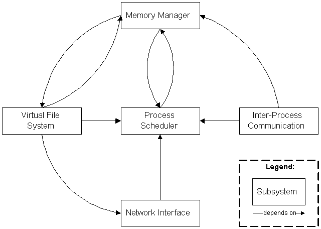
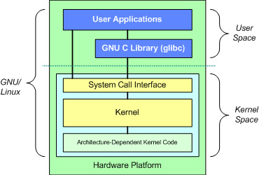

# Строение типичного дистрибутива GNU/Linux. Процесс загрузки.

Данное руководство не является самоучителем вроде "Мой первый компьютер",
поэтому сведения о загрузке именно ПК здесь будут пропущены.

## Базовые знания

### Ядро Linux

Linux - это ядро операционной системы (GNU/Linux), обеспечивающее программному
обеспечению доступ к ресурсам компьютера и предоставляющее наиболее низкий
уровень абстракции для доступа приложений к ресурсам системы, необходимым для их
работы. Как писал Таненбаум:

> Абстракция - это ключ к управлению сложностью.

Linux является *монолитным* ядром. Это классическая и наиболее распространённая
архитектура ядер ОС. Все части монолитных ядер работают в одном адресном
пространстве.

**Плюсы монолитных ядер:**

- Более прямой доступ к аппаратным средствам;
- Проще обмен данными между процессами;
- Процессы реагируют быстрее;

**Минусы монолитного ядра:**

- Большой размер;
- Более высокие требования к аппаратуре ПК, в частности, к ОЗУ;
- Менее безопасно.

Кроме того, монолитность усложняет отладку ядра, изменение функционала
(например, добавление новых функций, удаление легаси-кода, унаследованного от
старых версий ядра, etc.). Не следует забывать и про системные требования такого
типа ядер. Поэтому использование ОС с такими ядрами неоправдано в системах,
ограниченных, например, по объёму ОЗУ.

## Модули монолитных ядер как решение проблем пересборки

Раньше при любом изменении в аппаратуре ПК требовалось выполнить перекомпиляцию
монолитного ядра. Сейчас же Linux (может быть, и некоторые другие *монолитные*
ядра тоже) умеет динамически во время работы подгружать и выгружать *модули*,
выполняющий какие-либо из функций ядра. Пользователь может подключать
виртуализацию, какие-то другие из функций и прочее.

## Основные подсистемы ядра Linux

1. **Process Scheduled** (SCHED) - планировщик процессов, отвечающий за контроль
   над доступом процессов к CPU. Планировщик обеспечивает такое поведение ядра,
   при котором все процессы имеют справедливый доступ к ЦП компьютера.
2. **Memory Manager** (MM) - менеджер памяти, обеспечивающий различным процессам
   безопасный доступ к основной памяти системы. Кроме того, MM обеспечивает
   работу виртуальной памяти, которая позволяет процессам использовать больше
   памяти, чем реально доступно в системе. Отдельные фрагменты памяти, как
   правило, неактивные, перемещаются из ОЗУ в другое хранилище, например,
   жёсткий диск (в раздел или файл подкачки), освобождая ОЗУ для загрузки других
   активных фрагментов памяти. Это называется *подкачкой страниц* или
   *swapping*.
3. **Virtual File System** (VFS) - виртуальная файловая система, создающая
   абстрактный слой, скрывающий детали оборудования, предоставляя общий файловый
   интерфейс для всех устройств. Кроме того, VFS поддерживает несколько форматов
   файловых систем, совместимых с другими ОС.
4. **Network Interface** (NET) - сетевые интерфейсы. Обеспечивает работу с
   различными сетевыми стандартами и сетевым оборудованием.
5. **Inter-Process Communication** (IPC) - межпроцессорная система,
   поддерживающая несколько механизмов для `process-to-process` связей в единой
   Linux-системе.

<p align="center">Структура ядра Linux и основных
подсистем</p>

## Что тебе в имени моём?

<p align="right">Даже если проект GNU заслуживает благодарности за эту работу, разве стоит
спорить, когда люди не отдают должного? Разве важно не то, что работа выполнена,
а то, кто её проделал? Вы должны отдыхать, гордиться хорошо выполненной работой
и не беспокоиться о благодарностях.</p>

Как вишню не назови, вишней она быть не перестанет. Но если вы назовёте вишню
яблоней, то многие (адекватные) люди разочаруются, попытавшись найти там яблоки.
Также и у нас: Linux - это название *ядра*, а GNU/Linux - *операционной
системы*. Такая ОС включает в себя компоненты GNU (например, coreutils, grub,
make, gcc, gdb, awk и прочие), а также ядро Linux.

Кроме GNU/Linux существует
ещё и GNU/Hurd и, может быть, что-то ещё. Вы же используете тот, или иной
дистрибутив GNU/Linux. Под словом "*дистрибутив*" подразумевается *форма
распространения программного обеспечения*.

## Различия Free/Libre Software - свободного ПО, от Freeware Software - бесплатного ПО

Очень многие убунтоиды считают, что *свободное* = *бесплатное*, но на самом деле
это не так. Бесплатное ПО - это только бесплатное ПО, но не более. Может ли оно
вам гарантировать все 4 свободы (о которых далее) во всех случаях? Очень
навряд-ли.

СПО призвано обеспечить 4 свободы *пользователю:*

- Свобода использовать программное обеспечение безпрепятственно в своих целях;
- Свобода распространять копии программного обеспечения;
- Свобода изучать исходные тексты программного обеспечения и делать модификации
  этого ПО;
- Распространять модифицированные версии программного обеспечения.

## Различия Free/Libre Software от Open Source Software

Открытое ПО (Open SOurce Software) также не гарантирует всех свобод по
определению. Несмотря на то, что исходный код находится в свободном доступе,
может ли это гарантировать то, что вы можете делать с ним то, что считаете
нужным? Может ли это означать то, что вам доступны все 4 свободы? Конечно же
нет. Перед тем, как выполнять какие-либо действия с таким ПО, требуется
прочитать текст лицензии, под которой оно распространяется. И если лицензия
является *свободной*, то такое "открытое" ПО тоже свободно.

> Понятие бесплатности и открытости могут входить как в понятие свободного ПО, так
> и использоваться отдельно.

## Основные части дистрибутива GNU/Linux

1. Собственно, само ядро Linux, создающее абстрактный слой и являющееся
   "посредником" между ПО и hardware-частью компьютера;
2. **Hardware Controllers** (контроллеры оборудования) - подсистема,
   охватывающая всевозможные физические устройства, такие, как CPU, RAM, жёсткие
   и гибкие диски, сетевые карты...
3. **OS Services** (службы операционной системы) - службы, которые обычно
   являются частью ОС.
4. **User Applications** (пользовательские приложения) - набор пользовательского
   ПО. Такой набор разнится от дистрибутива к дистрибутиву GNU/Linux.

<div align="center"><p>Структура типичного
дистрибутива GNU/Linux</p></div>

Каждая подсистема может взаимодействовать только с двумя соседними,
расположенными непосредственно "выше" и "ниже" её уровня. Кроме того,
зависимости между этими подсистемами направлены сверху вниз: слои, расположенные
выше, зависят от частей ниже, но части, расположенные ниже, не зависят от
частей выше них.

## Структура директорий согласно FHS

В данном разделе речь пойдёт про иерархию ФС UNIX систем, соблюдающих стандарт
FHS (Filesystem Hierarchy Standard). Например, GNU/Linux. Всякие Gobo GNU/Linux
здесь не рассматриваются.

```
/	корень
|--- /bin	основные утилиты, необходимые как в однопользовательском режиме, так
|           и при обычной работе
|--- /boot	загрузочные файлы (собственно, файлы загрузчика, ядро, et cetera)
|--- /dev	файлы устройств (например, /dev/sda, /dev/sdb, et cereta)
|--- /etc	конфигурационные файлы системы
|    |--- /etc/opt	конфиги для /opt/*
|    |--- /etc/X11	конфиги X Window
|    |--- ...
|--- /home	содержит домашние каталоги пользователей, где юзеры хранят свои
|           файлы, настройки системы, специфичные для каждого пользователя
|           и т.п.
|--- /lib	основные библиотеки, необходимые для работы ПО из /bin и /sbin
|--- /media	точки монтирования сменных носителей
|--- /mnt	временно монтируемые ФС
|--- /opt	дополнительное ПО. Например, именно туда устанавливается легендарное
|           рабочее окружение TDE.
|--- /proc	виртуальная ФС, предоставляющая информацию о состоянии ядра ОС и
|           запущенных процессах в виде файлов
|--- /root	домашний каталог пользователя root
|--- /sbin	основные системные программы для настройки и администрирования
|           системы (init, ifconfig, mkfs, et cereta)
|--- /srv	данные для сервисов, предоставляемых системой
|--- /sys	содержит информацию об устройствах, драйверах и пр.
|--- /tmp	временные файлы, некоторые из них удаляются перед выключением
|           системы
|--- /usr	вторичная иерархия для данных пользователя. Содержит большинство
|           пользовательских приложений и утилит, используемых в
|           многопользовательском режиме
|    |--- /usr/bin	дополнительное ПО для всех пользователей
|    |--- /usr/include	стандартные заголовочные файлы
|    |--- /usr/lib	библиотеки для программ из /usr/bin и /usr/sbin
|    |--- /usr/local	третичная иерархия для данных, специфичных для данного
|                       хоста, содержит директории bin, lib, share, et cetera
|    |--- /usr/share	архитектурно-независимые файлы
|    |--- /usr/sbin	дополнительные системные программы (см. также: /sbin)
|    |--- /usr/src	исходные тексты ПО
|--- /var	изменяемые файлы, такие как кеш приложений и ПМ, логи и прочее
|    |--- /var/log	логи ядра, операционной системы и ПО
```

### Независимые классификации в FHS

Спецификация FHS основывается на идее существования двух независимых
классификаций файлов: разделяемых и неразделяемых, а так же изменяемые и
статичные. Разделяемые данные могут распространяться на несколько хостов;
неразделяемые специфичны для конкретного хоста (например, конфиги).
Соответственно, изменяемые файлы изменяются, а статичные - нет (за исключением
установки и обслуживания системы).

Резюме. 4 возможные комбинации + нужные директории.

| --         | Разделяемые    |   Неразделяемые |
|:-----------|:--------------:|:---------------:|
| статичные  | `/usr`, `/opt` | `/etc`, `/boot` |
| изменяемые | `/var/main`    | `/var/run`      |

# Процесс загрузки

## Загрузчик и ядро Linux

В данном разделе будут пропущены загрузка ПК, BIOS, UEFI и прочее, что не
относится к GNU/Linux напрямую. А начну с загрузчика, коих для GNU/Linux, как и
других UNIX-систем, довольно много. Но самый распространённый - это GRUB2.

Задача загрузчика - инициализировать ядро операционной системы (в нашем случае
ядро - Linux). В помощь ядру загрузчик может использовать *начальный образ
загрузки* - `initrd` или `initramfs` (initial ram disk или initial ram
filesystem) - представляющий собой архив с образом файловой системы,
разворачивающейся в ОЗУ в начале загрузки. В initrd/initramfs находятся нужные
драйверы, скрипты и прочее, что необходимо для инициализации оборудования и
прочих целей.

После начального образа загрузки загружается ядро. Оно *обычно* находится в
`/boot`, в своём названии имеет `vmlinuz`:

- `vm` - поддержка виртуальной памяти;
- `linu` - Linux;
- `z` - указатель того, что файл сжат (формат сжатия обычно `zlib`, но иногда
  можно встретить `bz2`, `lzma` и некоторые другие).

## Системы инициализации

После ядра стартует *система инициализации* в UNIX, которая запускает все
остальные процессы. Имеет PID (Process ID) = 1. Примерно до 2010 года де-факто
стандартом системы инициализации в GNU/Linux был SysVInit. Но после него были
попытки заменить SysVInit на другую СИ. Например, в Ubuntu первое время
использовался upstart, а в Gentoo GNU/Linux использовался и используется сейчас
OpenRC. В недрах компании Red Hat была создана система инициализации systemd,
которая в данный момент используется в подавляющем числе дистрибутивов
GNU/Linux.

Кроме того, в дистрибутиве Slackware использовался раньше и используется сейчас
сборочные скрипты в стиле BSD. Не даров Slackware называют "самым юниксовым".

> Если ты изучаешь Red Hat, то ты изучишь только Red Hat. А если ты изучаешь
> Slackware, то ты изучишь GNU/Linux.

Есть ещё Runit, Finit и другие СИ. У каждой свои достоинства и недостатки, но
самым популярным инитом стал systemd. Это связано с тем, что некоторые детали в
нём реализованы намного удобнее, чем в других системах, да и systemd был
разработан сотрудниками Red Hat, поэтому его широкое распространение вполне
предсказуемо.

Исполняемый двоичный файл системы инициализации находится в `/sbin/init`,
поэтому ядро ищет его именно там. Но ядру вы можете указать опцию
`init=/путь/до/инита`, чтобы загружать другую систему инициализации или какую-то
программу. Например, `init=/bin/bash`- опция ядра, которая довольно часто
встречается в разных статьях о восстановлении дистрибутива GNU/Linux после
поломки.

**Достоинства systemd:**

- Параллельный запуск служб и прочие вещи, позволяющие существенно ускорить
  запуск ОС.
- Запуск сервисов по расписанию (аналог `cron`).
- Смена корня (аналог `chroot`).
- Простой и лаконичный синтаксис служб.
- Удобный контроль этих служб.
- Анализ времени загрузки системы.

**Недостатки systemd:**

- Не Unix Way. systemd - монолитная и сложная система, заменяющая собой не
  только систему инициализации, но и кучу других утилит. Некоторые из пунктов,
  перечисленных в "достоинствах", можно отнести и к пункту "Недостаки". Кроме
  того, есть личности, которые сетуют на плохое качество кода. Но code review
  этого инита я не проводил, поэтому качество оценить, увы, не могу.
- systemd плохо работает на split-usr (CDS в терминологии Calmira GNU/Linux)
  конфигурации, о чём честно предупреждает во время сборки из исходного кода.
  Кроме того, поддержку split-usr конфигурации из systemd скоро уберут вообще.
- Этой системе инициализации в некоторых случаях может требоваться несколько
  больше ресурсов, чем другим СИ, из-за чего разработчики многих легковесных
  дистрибутивов GNU/Linux не советуют его использовать на слабом железе ПК и
  заменяют systemd на его менее прожорливых товарищей. Например, на SysVInit.

Раз уж начал речь про SysVInit, то, думаю, требуется написать и пару слов про
него.

**Достоинства SysVInit:**

- Устоявшаяся и хорошо понятная система.
- Простая и понятная настройка.
- Стабильная и надёжная работа.
- Небольшой вес и простое строение.

**Недостатки SysVInit:**

- Неудобная (а для некоторых ещё и сложная) работа с сервисами, особенно -
  отсутствие зависимостей сервисов.
- Последовательная обработка задач загрузки (т.е. когда каждый сервис
  запускается последовательно друг за другом, а не параллельно, как в systemd),
  что в некоторых случаях можеь замедлить скорость старта/выключения ОС.

## Последние действия

Как было написано выше, задача системы инициализации - запустить все необходимые
процессы ОС и подготовить её к работе. И здесь я опишу сценарий загрузки
системы без GUI, т.е. не загружается никаких DM, DE и прочего, а стартует
командная оболочка. После этого будет описан второй сценарий, когда в системе
установлен графический пользовательский интерфейс.

**Система без GUI**

В последнюю очередь выводится содержимое
текстового файла `/etc/issue`, в котором содержится приветственный
текст (в том случае, если файл пустой, то ничего и не будет
выведено), а после - загружается программа
`/bin/login`, которая запрашивает у человека имя пользователя и его пароль. В
том случае, если человек неправильно ввёл имя пользователя или его пароль,
программа запрашивает эти данные снова. Либо если пользователь не вводил их на
протяжении какого-то времени. Если введённые данные оказались правильными, то
запускается командная оболочка, установленная по умолчанию для пользователя, от
имени которого произведён вход в систему. Например, оболочка `/bin/bash` или
`/bin/tcsh`.

Вообще, командных оболочек очень много, самые основные:

- Bourne shell (`sh`) - "тот самый".
- Bourne again shell (`bash`) - усовершенствованная оболочка `sh`, ставшая
  классической в GNU/Linux. Во многих современных дистрибутивах GNU/Linux
  `/bin/sh` является ссылкой на `/bin/bash`.
- BusyBox - представляет собой целое пользовательское окружение, в том числе,
  командную оболочку (вызов: `busybox sh`). Достоинство: небольшой размер и
  "несерьёзные" требования к аппаратуре ПК. Используется во всевозможных
  минималистичных дистрибутивах GNU/Linux, таких, как Alpine, Floppinux и
  прочих.

**Система с GUI**

Здесь всё довольно размыто, ибо у GUI в GNU/Linux, как и вообще в UNIX-системах,
всё не так, как, предположим, у какой-то Windows. GUI здесь всё такой же
модульный, что имеет свои достоинства. Вообще, о графике в UNIX'ах можно
говорить бесконечно, ибо тема достаточно объёмная, но я постараюсь описать всё
вкратце.

GUI состоит из следующих компонентов:

- Display Server - дисплейный сервер.
- Display Manager (DM) - дисплейный менеджер.
- Desktop Environment (DE) - рабочее окружение.

Хочу заметить, что дисплейный менеджер может отсутствовать вообще, и тогда все
заботы пользователя по входу в систему и выборе нужной сессии перекладываются на
пользователя. В таком случае мы сможем лицезреть содержимое текстового файла
`/etc/issue` и приглашение к вводу имени и пароля программы `login`, а после -
приглашение к вводу командной оболочке. После же пользователь сам должен
запустить рабочее окужение или что-то другое, что ему нужно.

Кстати говоря, рабочее окружение так же необязательно. Многие пользователи
предпочитают не использовать уже "готовые" DE, считая их раздутыми и
тяжеловесными. Они отдают предпочтение "голым" оконны менеджерам (WM), которые могут
быть как компонентами DE (о компонентах DE далее), так и использоваться
отдельно. Некоторые пользователи сами собирают себе свои окружения из каких-либо
независимых компонентов.

Примером "отдельных" "независимых" оконных менеджеров являются i3, IceWM,
WindowMaker, OpenBox. Но никто не запрещает использовать их и в составе
каких-либо DE, например, OpenBox используется в составе LXDE.

Примером WM, котоыре обычно используются в составе DE (но в большинстве случаев
могут использоваться и без них) являются Mutter (GNOME), KWin (KDE), Xfwm
(Xfce).

# Компоненты DE

Рабочее окружение (DE) может состоять из следующих компонентов:

- Window Manager (WM) - оконный менеджер, т.е. программа, управляющая
  отображением и поведением окон в GUI. Многие WM умеют также работать с
  рабочими местами. В кажом рабочем месте пользователь располагает определённый
  набор окон.
- Средство запуска ПО (меню). В некоторых оконных менеджерах это средство уже
  втроено.
- Панель, на которой могут располагаться следующие элементы (апплеты/виджеты):
    - ср-во заруска ПО;
    - апплет переключения между открытыми окнами;
    - апплет системного трея;
    - другие элементы по усмотрению пользователя.
- Файловый менеджер, задача которого - не только работа с файлами, но и
  управление иконками на рабочем столе.
- Менеджер обоев рабочего стола (может быть встроен в некоторые WM).
- Какие-либо приложения по умолчанию (эмулятор терминала, программа для
  настройки системы и рабочего окружения, программа чтения электронных книг,
  текстовый редактор, калькулятор, etc.).
- etc.

Оконный менеджер, панель и некоторые другие компоненты могут быть использованы и
без рабочего окружения. Либо они могут не использоваться в рабочем окружении.
Некоторые DE позволяют выполнять замену некоторых своих компонентов на
сторонние. Например, MATE и Trinity поддерживают замену терминала, файлового
менеджера и некоторого другого ПО на стороннее.

Повторюсь, все приведённые выше данные довольно размыты. Например, файловый
менеджер, входящий в состав DE, может быть лишён функции управления рабочим
столом. Например, в KDE 4 и 5 функцию рабочего стола выполняет специальный
*виджет* (*плазмоид* в терминологии KDE), а в GNOME вообще убрали рабочий стол
как анахранизм.

Кроме того, оконный менеджер, панель и какие-то её доп. компоненты могут быть
объединены в одну монолитную систему. Как, например, сделано в GNOME: GNOME
Shell является оболочкой, объединившей в себя такие сущности, как GNOME Panel,
Mutter и Naulilus (панель GNOME, оконный менеджер Mutter и файловый менеджер
Nautilus соотв.).

# Описание компонентов графики

## Display server

Дисплейный сервер - программа, отвечающая за координацию ввода и вывода своих
клиентов с ОС, а так же между оборудованием и ОС. Именно благодаря Display
Server вы используете Linux в графическом режиме, а не в TTY. Когда говорят
"дисплейный сервер", нередко имеют ввиду `Xorg`, `Wayland`, `Mir` и прочие.
Сейчас самый популярный - Xorg, но он очень устарел, и его пытаются заменить на
другие инструменты. Например, на более совершенный и современный Wayland. А
дисплейный сервер Mir, который разрабатывается CanoniCAL, предназначен для
интернета вещей IoT. Хотя раньше предназначался для Ubuntu Desktop и Ubuntu
Touch.

## Display Manager

Первая программа, которая запускается при старте графики. Его основные задачи:
- запросить аутентификационные данные нужного пользователя (имя, пароль или
  отпечаток пальца).
- выбрать, какую среду рабочего стола запустить; в случае, если их несколько, то
  спросить у пользователя, какую запустить.

## Window Manager

Я не случайно в предыдущем пункте начал именно с WM. Во-первых, про DE было
сказано выше, а
во-вторых, оконный менеджер можно использовать отдельно от рабочего окружения.
Что такое `WM` было так же сказано выше. Можно выделить три вида оконных
менеджеров:

- `Стековые` (`плавающие`) следуют классической метафоре, которая на данный
  момент самая удобная и популярная. Классическое расположение окон, которые
  могут накладываться и перекрывать друг друга.
- `Фреймовые` WM располагают окна в виде `фреймов` (`плиток`), эти фреймы не
  способны перекрывать друг друга, подобное поведение встречается в графическом
  интерфейсе *Windows* 1.x. Наиболее удобно использовать такие оконные менеджеры
  посредством клавиатуры, хотя поддержка мыши во многих из них так же
  присутствует.
- `Динамические` (например, i3wm) - динамически переключаются между двумя
  режимами, описанными выше (`стековый` и `фреймовый` режимы).

## Резюмируя

Типичный дистрибутив GNU/Linux состоит из следующих компонентов:

- Ядро Linux/Linux-libre
- Компоненты GNU:
    - glibc;
    - coreutils;
    - grub;
    - make;
    - gcc;
    - прочие утилиты
- Система инициализации:
    - systemd/SysVInit/etc.
- Доп. системный софт
    - shadow;
    - kmod;
    - util-linux;
- Окружение пользователя:
    - TUI;
    - GUI;

Остальное ПО может присутствовать или отсутствовать от дистрибутива к
дистрибутиву. И список выше весьма приблизителен, так как не отражает
зависимостей указанного программного обеспечения[^1]. Учитывая все зависимости и
дополнительный софт, предназначенный для сборки и обслуживания системы, то
получится список в несколько десятков программ. Например, в LFS - около 90
пакетов ПО. Однако дистрибутив, собранный по этому руководству, считается
"спартанским", а в некоторых случаях - игрушечным.

[^1]: Разговор про управление программным обеспечением пойдёт позже.
