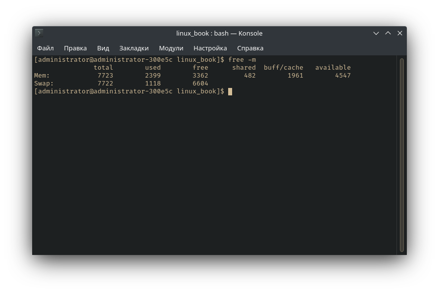
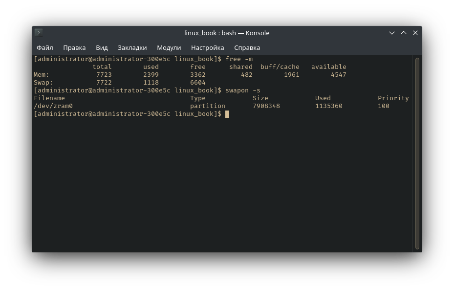

# Работа с RAM

В данной части пойдёт речь о двух вопросах. Первый: "как ядро Linux работает с
оперативной памятью?", второй: "о zram и подкачке".

Одной из наиболее важных и базовых подсистем в любой ОС является подсистема
работы с оперативной памятью (Memory Management Unit). Конструкция данной
подсистемы является довольно сложной, да и само ядро Linux активно развивается и
совершенствуется.

Поговорим про виртуальную память. Если с физической памятью всё понятно (это,
собственно, сама плашка оперативной памяти), то вот с виртуальной памятью могут
возникать всяческие непонятки.

В отличие от физической памяти, которую можно расширить только на аппаратном
уровне, виртуальная память является совокупностью физической памяти и подкачки
(swap).

swap является механизмом управления памятью, при котором отдельные фрагменты
памяти (как правило неактивные или малоактивные) могут быть перемещены из ОЗУ на
диск (либо же, если использовать zram, то в виртуальный раздел оперативной
памяти, но об этом позже). Поэтому можно утверждать, что размер виртуальной
памяти можно неограниченно расширять с помощью дисков и прочих устройств
хранения информации, но стоит учесть то, что доступ к фрагментам памяти,
расположенных на диске, будет значительно медленнее, чем непосредственно к RAM.
Хотите скорости - используйте zram. Так будет немного быстрее, чем использовать
подкачку на HDD или SSD.

Базовой единицей в организации памяти для ядра Linux является *страница памяти*.
Страница имеет размер от 4 Кб, которому соответствует объём физического
пространства в оперативной или виртуальной (область подкачки на диске или другом
устройстве хранения) памяти. Также существуют страницы и другого размера: т.н.
*Huge Pages* размером 2 Мб и страницы размером 1 Гб, но о них здесь не будет,
так как в этом руководстве содержатся лишь базовые сведения.

Процесс работает не с физической памятью напрямую, а с виртуальной. Виртуальная
память - это адресное пространство процесса. Такая абстракция позволяет
упростить разработку программного обеспечения, не думая о том, что можно
обратиться не к тем адресам памяти или адресу другого процесса. Ну и это
позволяет превышать размер основной оперативной памяти за счёт описанных выше
механизмов.

При запуске процессов, они запрашивают у системы (т. е. у ядра посредством
соответствующих системных вызовов) память для своей работы, а в ответ на это
ядро выделяет для них достаточное количество страниц памяти. Виртуальная память,
или как её ещё называют, «резервное ЗУ» (резервное запоминающее устройство) для
страниц памяти, которые содержат, к примеру, исходный текст исполняемого
приложения, представляют собой обычные исполняемые файлы на диске. Ровно как и
для других файлов данных, резервным ЗУ являются сами файлы. Информация о том как
взаимосвязаны страницы физической и виртуальной памяти хранится в
соответствующих таблицах страниц памяти.

Для работы с памятью в Linux характерно такое явление, как "страничный обмен"
(*paging*). Оно заключается в том, что ядро вызывает процессам столько памяти,
сколько им необходимо. В том смысле, чтобы её (памяти) всегда хватало. Это
достигается путём расширения физической памяти за счёт виртуальной, т.е.
подкачки. Поскольку выполнение процессов должно происходить в реальной
физической памяти, ядро постоянно перемещает страницы памяти процессов между
физической и виртуальной памятью. Забегая вперёд, следует отметить, что в
виртуальной памяти хранятся *"неактивные"* страницы, которые не задействованы
процессом в данный момент, но необходимые ему для полноценной работы
впоследствии.

Резюмирое всё вышеописанное, ядро старается управлять памятью таким
образом, чтобы недавно используемые процессом страницы находились в физической
памяти, а неактивные или редко используемые страницы перемещались в подкачку.
Такой механизм распределения памяти называется *LRU* (*Least Recently Used*).

Вторым важнейшим аспектом в работе памяти является использование кеш-буфера
страниц. Это вытекает из работы алгоритма LRU, который довольно сложен в своей
реализации. Поскольку следить за всеми обращениями к страницам - это, в
некоторых случаях, довольно ощутимые потери в производительности системы,
использование страничного кеш-буфера куда проще в своей реализации при тех же
самых результатах, к тому же, данный подход имеет огромный модернизационный
потенциал (в отличие от LRU) и алгоритмы анализа содержимого кеш-буфера
(для определения страниц, которые должны быть перемещены из
виртуальной памяти) постоянно совершенствуются, что заметно сказывается на
производительности и эффективности управления памятью.

Когда процессу не хватает памяти, то ядро начинает искать "занятые" страницы,
которые можно использовать для "голодающего" процесса. Обычно такими страницами
являются те, что давно не были использованы. Ядро проверяет их на предмет
модификации каким-то процессом и если изменения были, то такие страницы
помечаются ядром как "грязные". Для повторного использования памяти такие
страницы сначала обязательно переносятся в виртуальную память. Все же остальные
страницы являются "чистыми". И поэтому ядро их использует для предоставления
другим или "голодающим" процессам.

Когда происходит обращение к страницам памяти, которые некоторое или долгое
время не использовались, т.е. к "неактиыным" страницам, ядро выполняет с ними
несколько важных задач:

- Возвращает ссылки на эти страницы в соответствующей таблице страниц;
- Сбрасывает в нулевое значение время неиспользования этих страниц;
- Помечает эти страницы как активные.

Со страницами, находящимися в виртуальной памяти не всё так однозначно. Дело в
том, что для того, чтобы активизировать такие страницы, они должны быть
предварительно прочитаны с диска. Системное ядро комплектуется
специализированными модулями, которые содержат алгоритмы, с помощью которых
система довольно эффективно "предсказывает", сколько может потребоваться памяти
при разной степени активности и загруженности процессов. Эти алгоритмы имеют
своей целью обеспечение процессов свободной памятью с максимальной
эффективностью. Т. е. так, чтобы процессам как можно реже приходилось
простаивать в ожидании выгрузки очередной страницы в свободную память. Таким
образом, наблюдая за состоянием страничного обмена во время рабочей нагрузки
системы, можно делать выводы о том, нужна ли ей дополнительная память. Если
страничный обмен интенсивный — то однозначно следует установить дополнительные
модули ОЗУ.

Если же происходит так, что процессам не хватает ни реальной физической, ни
виртуальной памяти. Т. е. когда память полностью исчерпана, то система начинает
завершать (а точнее уничтожать) целые процессы. Либо запрещает создание новых.
Конечно в этом случае в первую очередь уничтожаются наиболее «безболезненные»
для системы процессы. Однако в таких случаях даже «на глаз» и по собственным
ощущениям видно что она большую часть времени тратит на управление памятью, а не
на выполнение рабочих задач.

В Linux можно настроить параметр, задающий то, насколько быстро ядро должно
«отбирать» страницы памяти у процессов, которым они менее нужны для процессов,
которым они на данный момент необходимы. Этот параметр содержится в файле
`/proc/sys/vm/swappiness` и по-умолчанию равен 60. В некоторых дистрибутивах
может
быть другим. Если задать его меньшим значением (например 0), то ядро будет
забирать страницы процесса в самую последнюю очередь, используя вместо этого
любые другие варианты. Если это значение в пределах между 60 и 100, то страницы
будут отбираться у процессов с более высокой вероятностью. О настройке
`vm.swappiness` читать в конце статьи.

В отличие от физической памяти, которую можно расширить только на аппаратном
уровне, виртуальная память является совокупностью физической памяти и swap.

Говоря простыми словами, чем больше значение `vm.swappiness`, тем чаще будет
использоваться подкачка.

## Практические сведения

```bash
cat /proc/meminfo
```


**Объяснение пунктов:**

- `MemTotal` - доступный объём оперативной памяти;
- `MemFree` - объём неиспользуемой оперативной памяти;
- `Buffers` - область памяти, в которой хранятся данные, ожидающие записи на
  диск; буфер позволяет процессам продолжать работу, не дожидаясь физической
  записи на диск;
- `Cached` - отображает объём памяти, занятый под кеш (файлы, каталоги, файлы
  блочных устройств, etc.);
- `SwapCached` - объём памяти, помещённый в подкачку, а затем перенесённый в RAM
  обратно, но при этом данные всё ещё присутствуют в подкачке;
- `Active` - объём памяти, который наиболее часто используется страницами
  памяти, данные страницы памяти освобождаются довольно редко;
- `Inactive` - соответственно, не используются в данный момент, страницы
  являются первоочерёдными кандидатами для выгрузки в подкачку в случае
  необходимости;
- `Unevictable` - страницы памяти, которые по каким-то причинам не могут быть
  помещены в подкачку.
- `Mlocked` - память, внесённая в адресное пространство системным вызовом
  `mlock()`;
- `SwapTotal` и `SwapFree` - общий и свободный объём подкачки;
- `Dirty` - изменённые страницы памяти, которые всё ещё находятся в RAM, но ещё
  не сброшены на диск;
- `Writeback` - память, которая в данный момент сбрасывается на диск;
- `AnonPages` - объём анонимной памяти;
- `Mapped` - объём памяти, внесённый в адресное пространство с помощью `mmap()`;
- `Slab` - объём памяти, выделенный под структуры ядра небольшого объёма;
- `PageTables` — память выделенная под страничную таблицу;
- `NFS_Unstable` указывает на объем памяти используемый для передачи данных по
  NFS v3+;
- `Bounce` — память используемая блочным устройством;
- `CommitLimit` — общий объем памяти, основанный на коэффициенте избыточного
  выделения (`vm.overcommit_ratio`), доступный в настоящее время для выделения в
  системе. Это ограничение соблюдается только в том случае, если включен строгий
  учет переопределения (режим 2 в `vm.overcommit_memory`);
- `Committed_AS` — объем памяти, выделенный в настоящее время в системе.
  Выделенная память - это сумма всей памяти, которая была выделена процессами,
  даже если она еще не была использована ими;
- `VmallocTotal` — виртуальное пространство, доступное для `vmalloc`;
- `VmallocUsed` — объем использованного пространства `vmalloc`;
- `VmallocChunk` — наибольший свободный блок внутри `vmalloc`;
- `HugePages_Total` — количество huge страниц, выделенных ядром;
- `HugePages_Free` — количество huge страниц, которые не выделяются;
- `HugePages_Rsvd` — количество huge страниц, которые должны были выделиться из
  пула, но еще этого не сделали
- `Hugepagesize` — количество huge страниц;
- `DirectMap1G` — память, выделенная под huge страницы размером 1GB.

Можем посмотреть на вывод программы `free`:



```bash
free -m
```

В строке `buffers/cache` показывается, сколько памяти используется и сколько
свободно с точки зрения её использования в приложениях.

## О подкачке

В предыдущем разделе шла речь про подкачку. В данном разделе про подкачку
приведены сведения о её создании. Практика в подобных руководствах - это хорошо
:).

Чтобы узнать, существует ли уже подкачка или нет, выполните:

```bash
swapon -s
```



## Рассчёт размера подкачки

Разные разработчики советуют разные методы рассчёта. Кто-то советует создавать
подкачку размером в половину ОЗУ. Кто-то советует создавать подкачку равную
объёму ОЗУ или превышающую объём ОЗУ в два раза. Но я всегда создаю подкачку по
первому совету, который говорит нам создавать её с объёмом в половину ОЗУ. Мне
достаточно :). В любом случае я советую создавать подкачку ровно того объёма,
которого будет достаточно пользователю для выполнения определённого круга задач.

### Создание файла подкачки

Чтобы создать файл подкачки:

```bash
sudo fallocate -l 1G /swapfile &&
sudo chmod 600       /swapfile &&
sudo mkswap          /swapfile &&
sudo swapon          /swapfile
```

**Объяснение новых команд:**

- `sudo fallocate -l 1G /swapfile` - создать файл `/swapfile`, размером 1 Гб. Чтобы выбрать другой размер, заменить "1G" на нужное значение.
- `sudo chmod 600 /swapfile` - в целях безопасности, выставить нужные права на файл. О правах на файлы читать в интернете.
- `sudo mkswap /swapfile` - создать файловую систему `swap`.
- `sudo swapon /swapfile` - включение подкачки.

### Настройка vm.swappiness

Теперь настройка свопа. Есть параметр, сообщающий ядру, как часто использовать
подкачку. Параметр имеет значения от 0 до 100, чем выше значение, тем чаще будет
использоваться swap.

Для того, чтобы проверить, какой параметр используется, выполнить:

```bash
cat /proc/sys/vm/swappiness
```

Например, в Fedora 36 значение равно шестидесяти. Если хотите изменить это значение, выполните:

```bash
sudo sysctl vm.swappiness=X
```

Где X - нужное значение.


### Сохранение изменений после перезагрузки

Как только система перезагрузится, придётся опять включать подкачку и выставлять
vm.swappiness, что, конечно, неудобно. Чтобы этого избежать, нужно сделать
соответствующую запись в `/etc/fstab`:

```bash
echo '/swapfile none swap sw 0 0' |sudo tee -a /etc/fstab
```

И записать в `/etc/sysctl.conf` нужное значение swappiness:

```bash
echo 'vm.swappiness=X' |sudo tee -a /etc/sysctl.conf
```

### Удаление файла подкачки

После сборки и настройки системы, вероятно, swap вам больше не понадобится.
Поэтому лучше его удалить.

Выполнить:

```bash
sudo swapoff /swapfile
sudo rm /swapfile
```

И удалить записи в `/etc/fstab` и `/etc/sysctl.conf`.

### Объяснение новых команд
- `sudo swapoff...` - отключить подкачку
- `sudo rm /swapfile` - удалить подкачку

## Важно
Когда полностью отключить подкачку, то ОС будет использовать только ОЗУ и в случае его нехватки система может просто зависнуть.

**Ну и пару нужных вещей:**

- Подкачка нужна для ровного и эффективного высвобождения оперативной памяти и
  использовать swap в качестве "экстренной памяти" не рекомендуется в принципе.
- Отключение `swap` не спасает от проблемы дискового ввода/вывода при
  конкуренции за память - дисковый `I/O` перемещается с анонимных страниц на
  файловые, что не только может быть менее эффективным, поскольку остаётся
  меньший пул страниц, доступных для высвобождения, но и само по себе может
  способствовать появлению этой высокой конкуренции.
